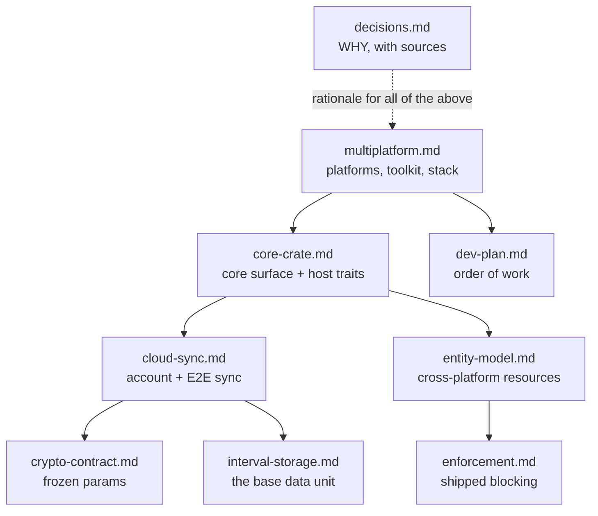

# Reeflect docs

TL;DR: two tracks — what is **shipped** in the extension today, and the **roadmap** to a multiplatform suite. Diagrams and tables carry the content; rationale lives in the [decision log](appendix/roadmap-decisions.md).

## Roadmap — multiplatform

Android / iOS / Windows / Linux / macOS + the extension, sharing one E2E data set on a
shared **Rust core** with a **Tauri** UI.

| Doc | Read it when |
|---|---|
| [multiplatform](architecture/multiplatform.md) | Which platforms can do what; why Rust, why Tauri |
| [core-crate](architecture/core-crate.md) | Building against the core, or implementing a host |
| [dev-plan](architecture/dev-plan.md) | What to build next |
| [cloud-sync](appendix/cloud-sync-design.md) | How sync, auth and retention work |
| [crypto-contract](appendix/crypto-contract.md) | Looking up an exact parameter |
| [entity-model](features/entity-model.md) | Cross-platform limits, matching, aliases |
| [decisions](appendix/roadmap-decisions.md) | **Challenging a decision** — rarely otherwise |

## Shipped — the extension today

- [Architecture](architecture/architecture.md) — event-sourced aggregator, DNR blocking.
- [Tracking internals](appendix/tracking-internals-pre-interval.md) — range engine, flush cycle.
- [Interval storage](appendix/tracking-interval-storage-design.md) — the base data unit.
- [Enforcement](features/enforcement.md) — web-only limit blocking.
- Others: [guided tour](features/guided-tour.md), [subdomain tracking](features/subdomain-tracking.md), [timeline](appendix/timeline-deferred-improvements.md), [bucket→interval migration](appendix/tracking-bucket-to-interval-migration.md).

## Who owns what

One owning doc per fact; the others link and never restate. This is what stops drift.

| Topic | Owner |
|---|---|
| Platforms, capability matrix, toolkit, stack | [multiplatform](architecture/multiplatform.md) |
| Core exports, host traits, `Time`, errors | [core-crate](architecture/core-crate.md) |
| Phase order and per-phase work | [dev-plan](architecture/dev-plan.md) |
| Sync protocol, auth, schema, retention, GDPR | [cloud-sync](appendix/cloud-sync-design.md) |
| Crypto parameters, wire payload, normative MUSTs | [crypto-contract](appendix/crypto-contract.md) |
| Resource identity, entity/alias resolution, fan-out | [entity-model](features/entity-model.md) |
| **Rationale + rejected alternatives, with sources** | [decisions](appendix/roadmap-decisions.md) |
| Shipped web-only blocking | [enforcement](features/enforcement.md) |
| The interval log | [interval-storage](appendix/tracking-interval-storage-design.md) |

## Doc conventions

- **Diagrams and tables carry the content.** Prose only where a diagram genuinely can't
  say it — normative parameters, legal wording.
- **Rationale lives in [decisions.md](appendix/roadmap-decisions.md)**, not inline. Specs say
  *what*; the log says *why*, with sources.
