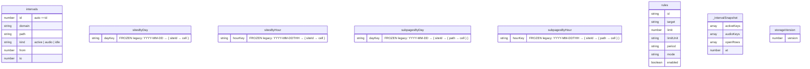

# Architecture reference

TL;DR: the storage schema diagram, the page read-path dispatch table and the module map, cut from `docs/architecture/architecture.md`. Reference only.

## Storage schema

`intervals` lives in the `browsing-intervals` IndexedDB (via Dexie). The four bucket maps, `rules`, `_intervalSnapshot` and `storageVersion` live in `chrome.storage.local`. The bucket maps are **frozen**: read-only legacy, no live writer.

### Ownership

| Key | Writers | Readers |
|---|---|---|
| `intervals` (IndexedDB) | background (interval tracker flush) | pages (via aggregates), background (enforcement / badge) |
| `rules` | popup, rules page | enforcement (background), rules page |
| `sitesByDay` / `sitesByHour` | import, migrations, seed | pages (stitch path), import/export |
| `subpagesByDay` / `subpagesByHour` | import, migrations | pages (stitch path), import/export |
| `_intervalSnapshot` | background | background |
| `storageVersion` | migrations | migrations |

## Page read path

The chrome message API is gone — pages read storage directly. The `QUERY_*` constants in `queryTypes.js` are **internal dispatch tags** for the merged reader (a leftover name from the old message API, now just read selectors).

Pages call `loadMergedTrackingData({ type: QUERY_*, ...args })` (`mergeDataSources.js`). It splits the request at `earliestDayKey()` and dispatches per day:

| Tag | Args | Returns | Purpose |
|---|---|---|---|
| `getSitesByDay` | - | `sitesByDay` map | full day-level history |
| `getSitesByHourToday` | - | today's hour buckets | today's hourly chart |
| `getSitesByHourForDay` | `dayKey` | that day's hour buckets | drill into a past day |
| `getAvgPerClockHour` | `siteIds?`, `range`, `dayKeys?` | `number[24]` | average ms per clock hour over a range |
| `getSubpagesByDay` | - | `subpagesByDay` map | path-level history |
| `getSubpagesByHour` | - | `subpagesByHour` map | path-level hourly history |

Interval days resolve through `intervalFetch` (IndexedDB, via `intervalAggregates`); pre-interval days through `bucketFetch` (`chrome.storage.local`). In mock mode (guided tour) fixtures are returned alone; when the log is empty every read falls through to buckets. Enforcement and the badge skip this reader and call `usageSince(windowStart)` directly for a light, uncached windowed aggregate.

## Modules

| Layer | File | Role |
|---|---|---|
| Background wiring | `src/background/background.js` | favicon cache, badge, the single 1-min `flush` alarm, enforcement check, pre-emptive block |
| Live tracker | `src/background/intervalTracker.js` | self-registers tab/window/SPA/idle listeners; configures the engine with a composite `domain+path` key and `_intervalSnapshot`; exports `flushNow()` and the raw `flushToStorage` drain |
| Range engine | `src/background/intervalTrackingUtils.js` | generic presence-range state machine (`createTrackingModule` + `createRangeTracker`); snapshot/recover, idle clip; `flushToStorage` writes interval rows |
| Interval store | `src/data/intervalLog.js` | the `browsing-intervals` IndexedDB; row CRUD, `allIntervals`, `intervalsSince`, `intervalStats` |
| Derived aggregates | `src/data/intervalAggregates.js` | reconstructs day/hour site & subpage shapes, visits, avg-per-hour from rows; `usageSince`, `earliestDayKey` |
| Merged reader | `src/data/mergeDataSources.js`, `intervalProvider.js`, `bucketProvider.js` | page-side read; stitches interval days over frozen buckets |
| URL resolution | `src/background/siteResolution.js` | `siteIdFromUrl`, `pathFromUrl` |
| Debug | `src/background/trackingDebug.js` | `dbg` / `initDebug` / `isDebug`, gated on `_debug` |
| Enforcement | `src/background/enforcement.js`, `badge.js` | `computeOverage`, `publishOverage`, toolbar badge |
| Legacy bucket keys | `src/data/bucketKeys.js` | storage-key constants for the frozen scalar tier |
| Data utilities | `src/data/migrations.js`, `importBuckets.js`, `ttImport.js`, `exportPayload.js`, `prune.js`, `seedTestData.js`, `csvExport.js` | schema migrations, import/export, pruning |
| UI views | `src/pages/{dashboard,site,path,rules,popup,blocked,storage-management,...}` | tracking views (read-only) + rule editor |
| UI shared | `src/shared/*.js` | charts, drilldowns, formatting, theme |
