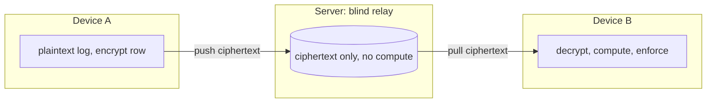
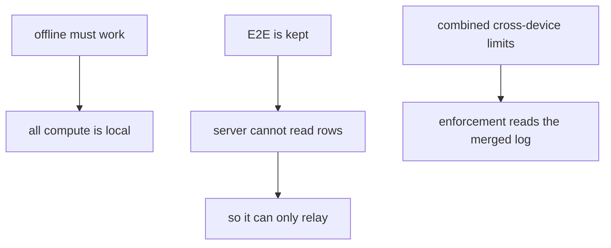
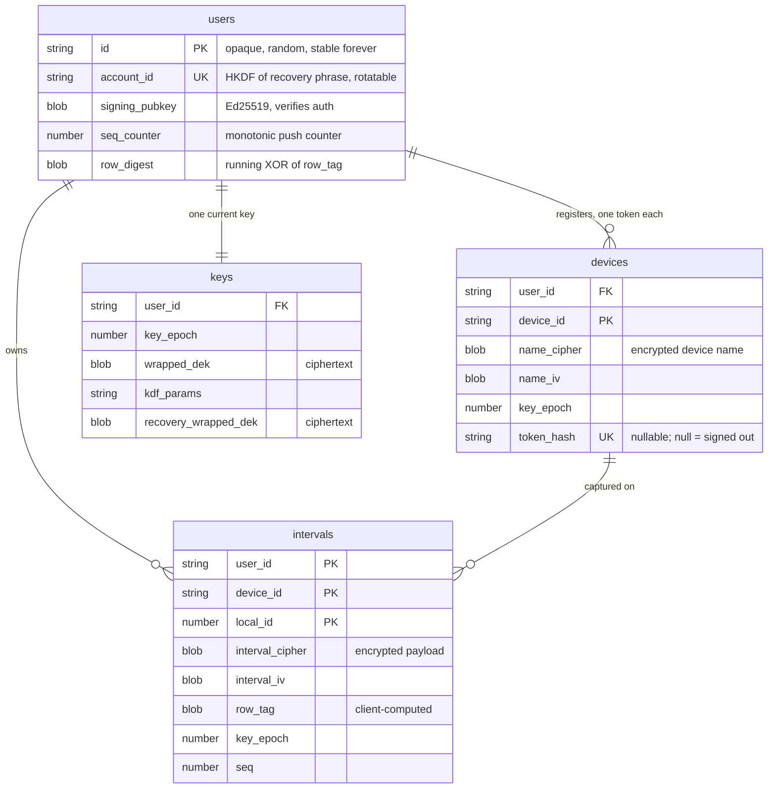
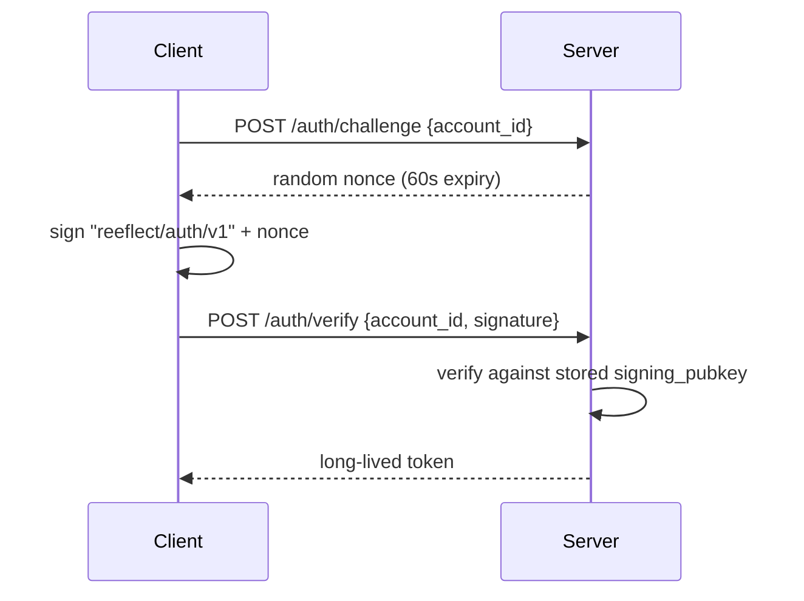
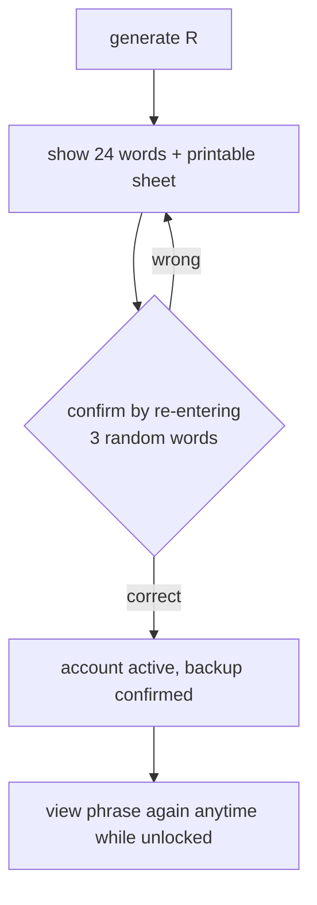
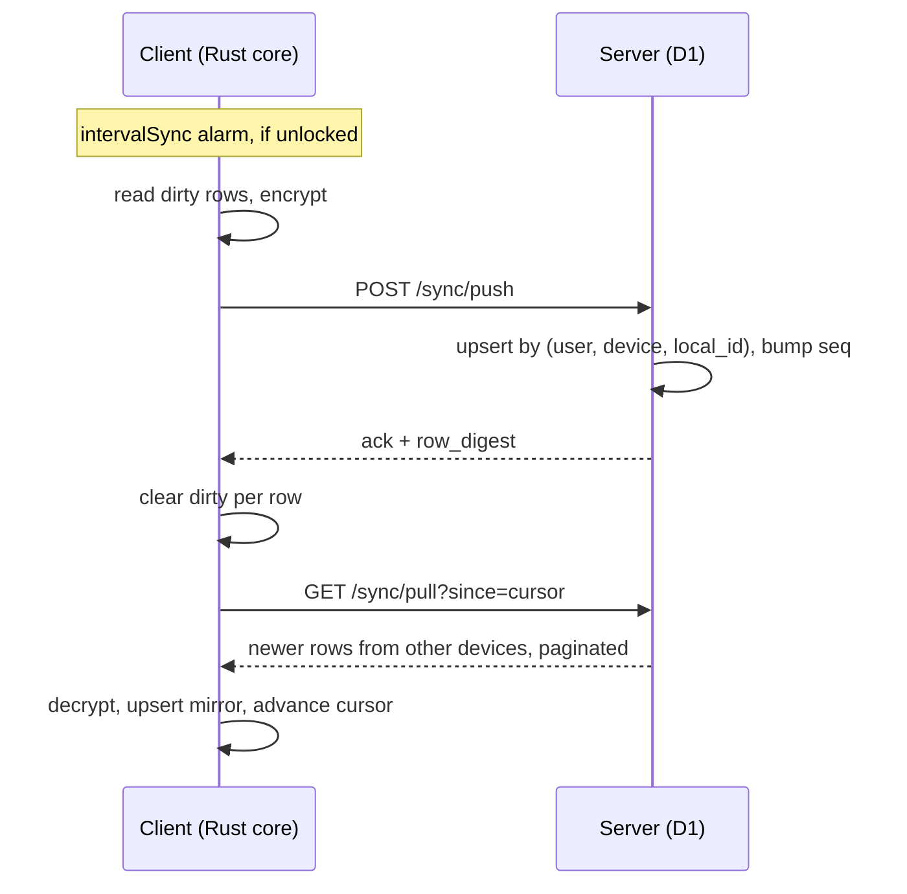
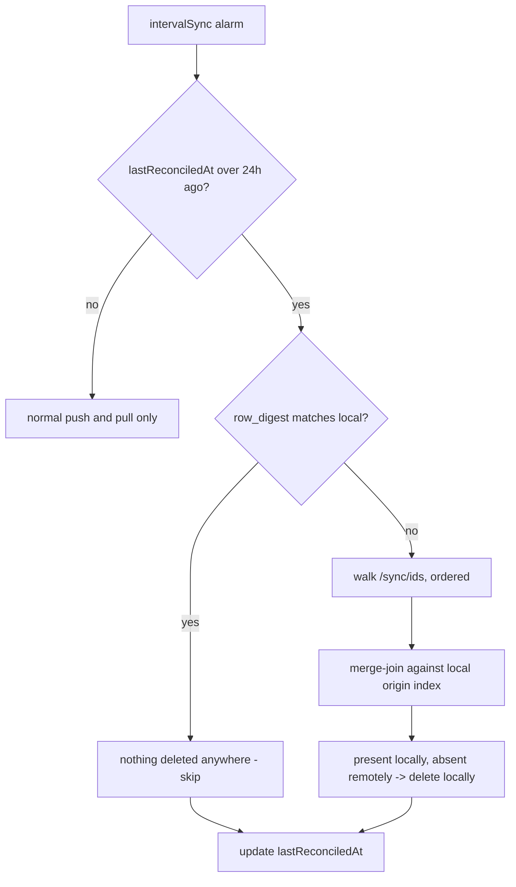
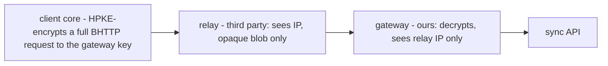
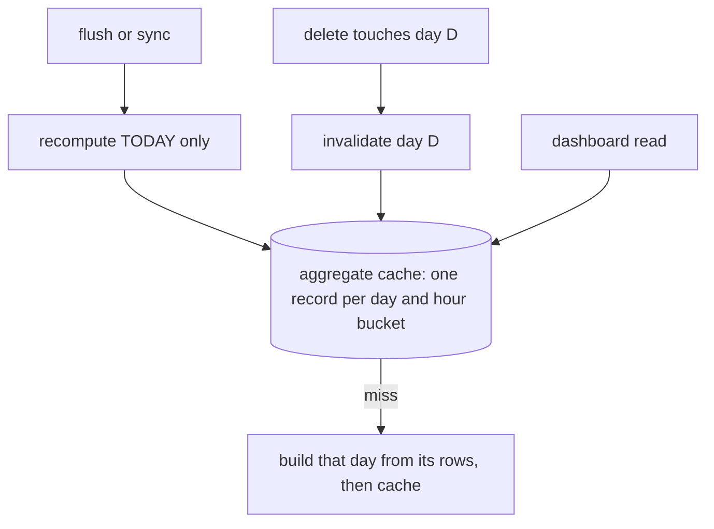

# Cloud sync

> Cross-device sync of the interval log. **No identity collected** — no email, no phone,
> no name. Server is a blind ciphertext relay. Every client computes and enforces
> locally, so everything works offline.

**Params:** [crypto-contract.md](crypto-contract.md) · **Why:** [decisions.md](../appendix/roadmap-decisions.md) · **Client surface:** [core-crate.md](../architecture/core-crate.md)



Three constraints forced this shape; it was not a free choice:



## Decisions

| | |
|---|---|
| Backend | Cloudflare Worker + D1 |
| Identity | **none** — pseudonymous `account_id` = HKDF(recovery phrase) |
| Auth | Ed25519 challenge-response |
| Sync | Full replication, alarm-driven push/pull deltas |
| Encryption | Per-row wrapped-key E2E, **all fields incl. timestamps** |
| Recovery | Recovery phrase only. **No email backstop** |
| Email | **None, ever** — a mailed recap can't be E2E |
| Retention | **Never auto-prune.** User-initiated delete only |
| Enforcement | Combined across devices (per-device is post-v1) |
| Logged-out capture | Capture always, claim rows on login |
| Interval log | Authoritative + synced; scalar buckets frozen legacy |

## Server storage (D1)



```
INDEX intervals(user_id, seq)
INDEX intervals(user_id, device_id, local_id)   -- reconciliation order
```

Everything named `_cipher` or `_dek` is opaque to the server. `device_id` stays plaintext
— an opaque UUID with no semantic content, needed as the routing key. `seq` bumps on
insert *and* update, so a row's `to`-extension resurfaces to other devices.

## Worker vs client

The Worker's list is short — that is what "dumb relay" means.

| Worker does | Client does (shared Rust core) |
|---|---|
| `/auth/challenge` — issue + store a nonce | **All** crypto: Argon2id, HKDF, Ed25519, AES-GCM |
| `/auth/verify` — check signature, issue token | Retention policy + mechanism |
| `/account/register` — store pubkey + wrapped keys | Aggregation and the block decision |
| `/sync/push` — upsert by PK, bump `seq`, XOR `row_tag` into `row_digest`; **or** `DELETE` if flagged | The full local mirror — the only place plaintext exists |
| `/sync/pull` — rows where `seq > cursor AND device_id != me`, paginated; carries `row_digest` | Sync orchestration: batches, pages, cursors |
| `/sync/ids` — identities only, ordered by `(device_id, local_id)` | All UI |
| Device management, account deletion, rate limits | |

No encryption, no key derivation, no retention decisions, no aggregation over row
contents. Every operation is a lookup, an insert/update, a signature check, a counter
bump, or an XOR of a **client-supplied opaque tag**.

## Auth

Authentication ≠ identity. The server only needs "same account as before", which a
keypair proves.



Replay protection is normative — see [crypto-contract MUST 7](crypto-contract.md#normative-musts).

**Anti-enumeration:** `/auth/challenge` returns a well-formed nonce for *any*
`account_id`, existing or not; `/auth/verify` does **constant work** for unknown accounts
(verify against a dummy key) and returns an identical error body. Rate-limit both per IP.
([OWASP](https://owasp.org/www-project-web-security-testing-guide/latest/4-Web_Application_Security_Testing/03-Identity_Management_Testing/04-Testing_for_Account_Enumeration_and_Guessable_User_Account))

**Unlock chain** — the recovery phrase is needed **once per device**:

```
first link:  recovery phrase -> account_id + signing key -> authenticate
every later: passphrase --Argon2id--> KEK --unwraps--> DEK --unwraps--> signing key
```

The signing key is stored **wrapped under the DEK**, so a browser restart never
re-prompts for the phrase. The passphrase never reaches the server in any form.

### Recovery-phrase UX

Total lockout is possible by design, so setup must earn the backup rather than assume it.



| Rule | Why |
|---|---|
| **Forced confirmation** — re-enter 3 random words before the account activates | The standard wallet-seed pattern. Catches "I'll write it down later" |
| **Store R wrapped under the DEK** (`wrappedRecovery`), like `wrappedSigningKey` | Otherwise the phrase is unviewable after setup and a user who *did* lose their copy has no path back while still logged in. Near-neutral on security: anyone with an unlocked DEK already owns the account |
| **No periodic nagging** once confirmed | It is re-viewable on demand, so reminders add annoyance without adding safety |
| Printable / downloadable sheet | Offline backup, no third party |

<sub>The wrapped copy does <strong>not</strong> weaken the lockout guarantee: it is encrypted under the DEK, so losing both the passphrase and the phrase still loses the account. It only helps a user who is currently unlocked.</sub>

## Sync tick



Resumable by construction: dirty flag + idempotent upsert + persisted cursor mean
service-worker death mid-sync is safe. `dbg()` at push / pull / merge / claim /
reconcile.

**Claim on first link:** rows captured before the device had an account are marked
`dirty` on link, so they sync up under the now-active account.

## Retention

**Nothing is ever pruned by age.** Deletion is user-initiated only ("forget this site",
targeted delete, account deletion) and is a genuine `DELETE` — no tombstone, because the
row not existing *is* the signal.

The row set therefore grows without bound by design. Sizing baseline: **~600
rows/day/device** (measured — 29,314 rows over 7 weeks), so three devices over five
years is ~3.3M rows. Everything below is built for that.

Deletes ride the next push. The Worker's only retention logic is one branch: delete
request in → `DELETE` instead of upsert. Idempotent.

Propagation is separate, and reuses the daily alarm:



| Property | How |
|---|---|
| Constant memory | both sides ordered by `(device_id, local_id)` ⇒ streaming merge-join, one page per side |
| Usually free | `row_digest` rides every pull; deletions are rare, so the walk is normally skipped |
| No propagation cliff | a device offline for a year converges on **one** pass — the check is "absent from *current* state", never a signal it could have missed |
| Safe failure | digest mismatch ⇒ an unnecessary walk (harmless); missing a divergence needs a 128-bit hash collision |

## Client storage

**IndexedDB** (`browsing-intervals`) — additive, engine untouched:

| Field | Rows | Purpose |
|---|---|---|
| `deviceId` | all | Global identity is `(deviceId, localId)`; `localId` = existing `++id` |
| `dirty` | own | Push cursor. Set on append/touch, cleared on ack |
| `origin` `{deviceId, localId}` | mirror | **Indexed** — idempotent upsert, and reconciliation order |
| `interval_cipher`, `interval_iv`, `row_tag` | synced | Only ciphertext is pushed |

**`chrome.storage.local`** (tiny — interval data lives in IndexedDB):
`_deviceId` · `account` `{accountId, token}` · `wrappedSigningKey` · `wrappedRecovery` ·
`lastPulledSeq` · `lastReconciledAt` · `deviceRegistry` · `wrappedKeyCache`.

The **unwrapped** DEK never goes here — see [DEK at rest](crypto-contract.md#dek-at-rest).

## Threat model

| Operator can see | Why | Mitigation |
|---|---|---|
| **IP address** | Inherent to networking. Personal data under CJEU *Breyer* | v1: no logging, no persistence, VPN/Tor documented. Structural fix: **OHTTP**, opt-in, post-v1 (below) |
| **Sync timing** | Request timing isn't encrypted even though row timestamps are | Jittered interval |
| **Volume** | Needed to store and paginate | Batch padding, partial. Accepted |
| **Linkability** | Sync must know which rows belong together | Inherent |
| **Payment identity** (if ever paid) | A processor collects name/card/billing | Separately-keyed billing id, no stored mapping to `users.id` — see [decisions](../appendix/roadmap-decisions.md) |

**Provably cannot see:** browsing content (domains, paths, times, kinds, sources), device
names, or any key.

### OHTTP — decided: opt-in, post-v1, no preparation needed



| Decision | |
|---|---|
| **Ship it?** | Post-v1, and **opt-in per user** — never the mandatory transport |
| **Where does it live?** | **The core.** HPKE encapsulation is crypto, and all crypto is core-side |
| **Does the `Http` trait change?** | **No** — the host still just posts bytes to a URL |
| **Rework needed to stay ready?** | **None.** See below |
| **Trigger to build** | A relay run by a **genuinely separate legal entity** on stable terms — not Privacy Gateway specifically |

**Why no preparation is needed.** OHTTP encapsulates a **complete** Binary HTTP request —
method, target, headers, body ([RFC 9292](https://www.rfc-editor.org/rfc/rfc9292.html),
`message/bhttp`). `Http::send(req: Request)` already receives exactly that, because the
core builds the whole request. Adopting OHTTP is then: encapsulate before returning the
`Request`, and point it at the relay. The trait, the hosts and the Worker are untouched.

<sub>That property is accidental — <code>Http</code> was made transport-only to keep token and endpoint handling in the core, not for OHTTP. It happens to be the exact shape OHTTP needs.</sub>

**Why opt-in rather than mandatory.** A relay is a hard availability dependency: if it is
down, sync is down. Mandatory OHTTP hands a third party the power to break sync for every
user. Opt-in confines that to people who chose the tradeoff and keeps the default path
dependency-free.

<sub>Cost of opt-in: the gateway can see that a given account always arrives via relay. A weak signal, and not the IP — which is the entire point.</sub>

**Key configuration.** [RFC 9458](https://www.rfc-editor.org/rfc/rfc9458.html)
deliberately does not define key acquisition, so we must: fetch `application/ohttp-keys`
from our own gateway over authenticated HTTPS. The config **MUST** be integrity-protected
and attributable to the gateway, or a client can be steered onto an attacker's key.

**What it buys, precisely.** The linkage, not the content — the payload is already E2E.
Today the server observes `(IP, account_id)` on every sync and could build a location
profile per account; under OHTTP the gateway sees `account_id` and ciphertext, never the
IP.

**What we will never claim: unlinkability.** RFC 9458 names *"identity information and
authentication credentials"* as correlation vectors and requires clients to avoid linkable
auth across requests. Ours carries a stable token by necessity — sync must know whose rows
these are. The claim earned is *"the server never learns your IP"*, full stop.

**Non-collusion is an assumption, not a guarantee.** Relay and gateway must be different
entities; same operator and the property collapses.

**v1 ships the honest free tier meanwhile:** no IP logging, no IP persistence in D1,
Cloudflare disclosed as sub-processor, VPN/Tor documented.

## GDPR

| Right | How |
|---|---|
| Export | **Client-side** — server holds only ciphertext |
| Erasure | `DELETE /account` wipes rows, keys, devices (which revokes every session) |
| Device management | Registry lists devices, names decrypted client-side |

**GDPR applies in full despite collecting no email** — Recital 26: pseudonymised data is
still personal data. `account_id`, `device_id`, IPs and ciphertext rows are all personal
data. Dropping email reduces blast-radius, not obligations: DPA with Cloudflare, privacy
policy, erasure/export, sub-processor disclosure all still required.

## Milestones

| | |
|---|---|
| **v1a** | Worker + D1, auth, device registry, push/pull, claim-on-login, GDPR endpoints, rate limits. Rows are opaque JSON. **Pre-launch only — no real users**, since v1a writes plaintext |
| **v1b** | Real E2E: wrapped-key, passphrase + recovery UI, per-row encryption. No server migration. Includes a one-time re-encryption pass over any pre-v1b rows |

Build order within each: server + auth → sync engine → account UI → hardening.

## Edge cases

| Case | Behaviour |
|---|---|
| `deviceId` reset (reinstall) | New id; old rows pull down as mirrors. Old server rows orphaned until forget-device |
| Cloned profile | Two machines could share a `deviceId` and fight over one row's `to`. Generate `deviceId` lazily on first sync with a collision check |
| **Account switch** | **Must regenerate `deviceId`**, or the `device_id != me` pull filter permanently hides this device's own pushed rows. Keeping the id *and* its rows would leak account A into account B |
| Cross-device same-site use | `unionLen` collapses simultaneous use to one. Intended |
| Clock skew | Timestamps are client-authoritative and encrypted; server can't validate. A wrong clock smears that device's data |
| Forgot passphrase | Unlock via recovery phrase, set a new one. No data loss, no epoch bump |
| **Forgot both** | **Total lockout** — the account itself is lost, not just the data. Only escape: a still-authenticated device. The direct cost of zero PII |
| Quota / offline | Capture and local compute continue; sync retries next alarm |

## Out of scope (v1)

Per-device enforcement mode · server-side compute of any kind · real-time/WebSocket
convergence · a hosted web dashboard · syncing scalar buckets · multi-account-per-device.

## Derived aggregates

`intervalAggregates` loads the whole log via `toArray()`. Under never-prune that does not
survive: 3 devices × 5 years ≈ 3.3M rows ≈ **hundreds of MB** of JS objects in a service
worker.

**A closed day's aggregates are immutable.** Compute once, persist, never recompute —
only *today* is live.



Same structure as the legacy
[aggregates-indexeddb](../features/storage-aggregates-indexeddb.md) design (one record
per time bucket), applied to interval-derived cells:

| | |
|---|---|
| Peak memory | **one day of rows** (~1,800 at 3 devices), not the whole log |
| Invalidation | per-day, and only deletion invalidates a closed day |
| Backfill | a pulled mirror row invalidates the day it lands in |
| Source of truth | still the interval log — this is a cache, rebuildable at any time |

Dashboard aggregation stays client-side JS (per
[core-crate](../architecture/core-crate.md#not-in-the-core)); only its *storage* changes.

## Sync cadence vs enforcement accuracy

A device that hasn't synced under-counts combined usage and can overshoot a limit.

> **Overshoot ≤ `S × (N−1)`** — where `S` is the sync gap and `N` the active device
> count. It does **not** depend on the remaining budget: others can consume at
> `(N−1)×` realtime the whole time you're unsynced.

A fixed cadence is therefore wrong — it ignores how tight the limit is. At `S` = 5 min,
`N` = 2, a **10 min/hour** limit overshoots by 5 min: **50% over**. The same 5 min against
a 4 h/day limit is 2%, and fine.

**So the cadence scales with the tightest active limit:**

```
S = clamp( L_tightest / (10 × max(1, N−1)),  1 min,  5 min )
```

| Tightest active limit | 2 devices | 3 devices |
|---|---|---|
| 10 min / hour | **1 min** | 1 min |
| 1 h / day | 5 min (clamped) | 3 min |
| 4 h / day | 5 min (clamped) | 5 min (clamped) |

That holds worst-case overshoot to **~10% of the tightest limit**, whatever its size.

Two escalations sit on top, both reusing machinery that already exists:

| Trigger | Behaviour |
|---|---|
| Any rule ≥ **80%** of its limit (the shipped `APPROACHING_THRESHOLD`) | drop to the 1 min floor |
| Navigation to a site matching a near-limit rule | sync **before** deciding — bounded by navigation, not by a clock |
| **Single device** | no opportunistic sync at all — nothing else can consume |

The floor is 1 min because sub-minute syncing costs battery and quota for no real
accuracy gain, and `chrome.alarms` has its own floor besides.

<sub>Why not scale by <em>remaining</em> budget: the lag is in what you know about <em>other</em> devices, so a device sitting at 0% can still be 10 minutes stale about a peer that burned the whole budget. Proximity to the limit is the escalation trigger; the tightest limit sets the baseline.</sub>

## Operational defaults

Tunable, not load-bearing — stated so implementation isn't guessing:

| Knob | Default | Note |
|---|---|---|
| `intervalSync` alarm | **adaptive, 1–5 min** | `clamp(L_tightest / (10 × max(1, N−1)), 1, 5)` — see [cadence](#sync-cadence-vs-enforcement-accuracy). Not a fixed number |
| Push batch | **500 rows** | |
| Pull page | **500 rows** | loop on `nextSeq` until drained |
| Reconcile gate | **24 h** | the `lastReconciledAt` guard |
| Token lifetime | **no expiry** | manual revoke only — refresh-rotation is over-built here |
| Auth rate limit | **10/min per IP** | on `/auth/challenge` and `/auth/verify` |
| Opportunistic sync floor | **1 min** | never sync more often, whatever the budget says |

## Open questions

**None blocking.** Two standing items, both settled architecturally and waiting only on
outside events:

| Item | State |
|---|---|
| **OHTTP** | **Decided** — opt-in, post-v1, [no preparation needed](#ohttp--decided-opt-in-post-v1-no-preparation-needed). Waiting on a relay run by a genuinely separate legal entity. Latency stays unmeasured until one exists; it cannot block anything, since the default path never uses a relay |
| **Paid tiers** | **Architecture decided** — billing gets a separately-keyed id with no stored mapping to `users.id`; the `users.id` / `account_id` split is the seam. Whether to charge at all is a business call that blocks nothing |
