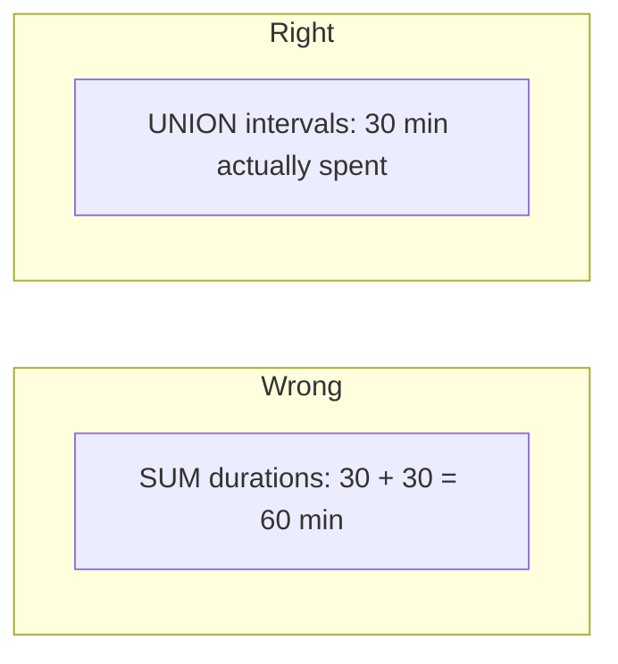
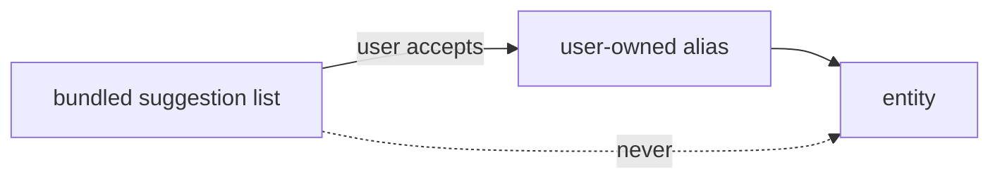
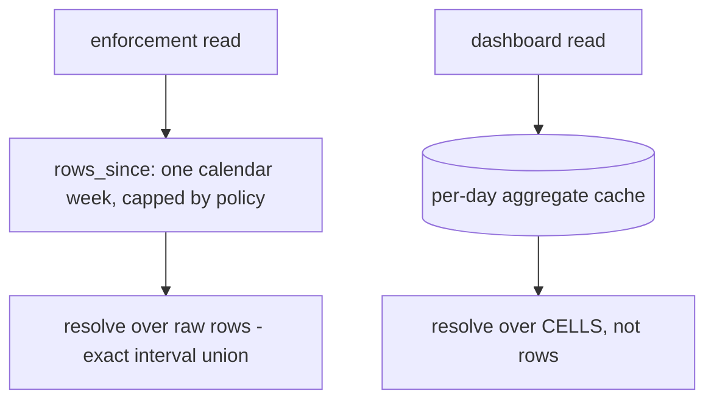

# Entity model — design detail

TL;DR: overflow detail from [entity-model.md](../features/entity-model.md) — browser-overlap maths, platform producer/consumer roles, extensibility hooks, and the resolved sub-decisions on aliases, browser identification, granularity and aggregation cost. Reference, not required reading.

## Browser overlap

On one machine the extension logs `web:youtube.com` while a desktop tracker logs
`desktop:chrome.exe` — the same wall-clock under **two entities**. This is **intended**,
and is not a double count:

- **v1:** the desktop tracker counts browsers as a **distinct, visible fallback entity**
  ("Chrome (browser)"), never merged into a web entity. Browser time is never silently
  hidden.
- **Any total MUST be an interval union** (`unionLen`), never a sum of per-entity
  durations. Under union the overlap collapses to the time actually spent.
- **v2 (optional):** liveness-gated exclusion — stop logging `desktop:<browser>` when a
  same-device extension is live in it. A UX cleanup, not a correctness fix.
- **Rejected:** subtracting extension web-time from browser process time (fragile).

## Producer / consumer roles

| Platform | Produces | Enforces |
|---|---|---|
| extension (Chromium / Firefox / Firefox-Android) | web | web (DNR) |
| Android app | app | app (Accessibility) |
| desktop app (Windows / Linux-X11 / macOS) | desktop + browser fallback | desktop |
| **iOS** | little — opaque tokens | app (`ManagedSettings`, own token map) |
| **Linux-Wayland** | degraded — no foreground query | desktop, best-effort |

**iOS seam:** Screen Time exposes opaque `ApplicationToken`s, not package names, so iOS
can neither emit `app:` rows nor map its tokens to a shared entity by id. Its enforcement
of a cross-device entity is limited to what the user configures inside iOS Screen Time.
Known and unavoidable.

## Built to grow

| Hook | Enables |
|---|---|
| Schema-versioned rules | new capabilities = optional field + backfill |
| `source` axis orthogonal to `matchType` | new sources without touching web rules |
| Pluggable window model: `period` → `{ type: calendar \| rolling, unit, n }` | rolling-7-day and custom windows |
| Per-source matcher + enforcer registries | a new platform registers without changing the decision core |
| Version-tolerant wire payload | new row fields, migration-free and re-encryption-free |

## Aliases: user-defined, permanently

**No curated catalog ships as a dependency.** A live catalog is an unbounded maintenance
commitment — apps get renamed, packages change owners, services appear — with no v1
payoff.

If pre-linked suggestions are ever wanted, they ship as **seeds, not a dependency**:

Accepting a suggestion **copies** it into user data. Nothing references the catalog at
runtime, so a stale suggestion is inert, there is no sync infrastructure, and the feature
degrades to exactly what v1 already has.

## Identifying browsers

The desktop tracker needs to know a process is a browser so it becomes a visible fallback
entity. **Default: an exe-name list, user-overridable.**

That is enough because **misidentification is cosmetic, not a correctness bug**:

| Case | Result |
|---|---|
| Browser recognised | shown as "Chrome (browser)" |
| Browser **not** recognised (renamed, portable, unusual Flatpak) | shown as a normal desktop entity under its own name — same data, less friendly label |
| Non-browser wrongly listed | mislabelled; usage still correct |

No branch of that table loses or double-counts time, so a fragile list is an acceptable
default. The v2 liveness signal (above) supersedes it where our own extension is running.

## Granularity: whole app or process

**No sub-resource limits for app/desktop.** The unit is the whole app or process; `path`
stays empty on those rows.

Not a v1 cut — the platforms don't offer it. There is no stable, cross-app identifier for
"screen within an app" on Android or desktop, so a sub-resource limit would have nothing
reliable to bind to. The wire payload's optional `path` is already there if a platform
ever exposes something.

## Aggregation cost

Entity resolution adds a matcher pass, but it runs against **bounded inputs on both
paths**:

| Path | Input | Why bounded |
|---|---|---|
| Enforcement | raw rows in the rule window | one calendar week by policy, and it must stay raw — `unionLen` needs actual intervals |
| Dashboard | cached per-day cells | a day has tens of `(domain, path)` keys, not hundreds of rows |

**The cache is matcher-independent** — it is keyed by `(domain, path, kind)`, so editing
a rule or alias does **not** invalidate it. Entity grouping happens at read time over the
small cell set.

Why enforcement can't use the cell cache: two rows of the same entity overlapping in wall-clock must collapse via <code>unionLen</code>, and pre-summed cells can't express that. Bounding the window is what makes reading raw rows affordable there. See <a href="../cloud-sync/cloud-sync.md#derived-aggregates">derived aggregates</a>.

