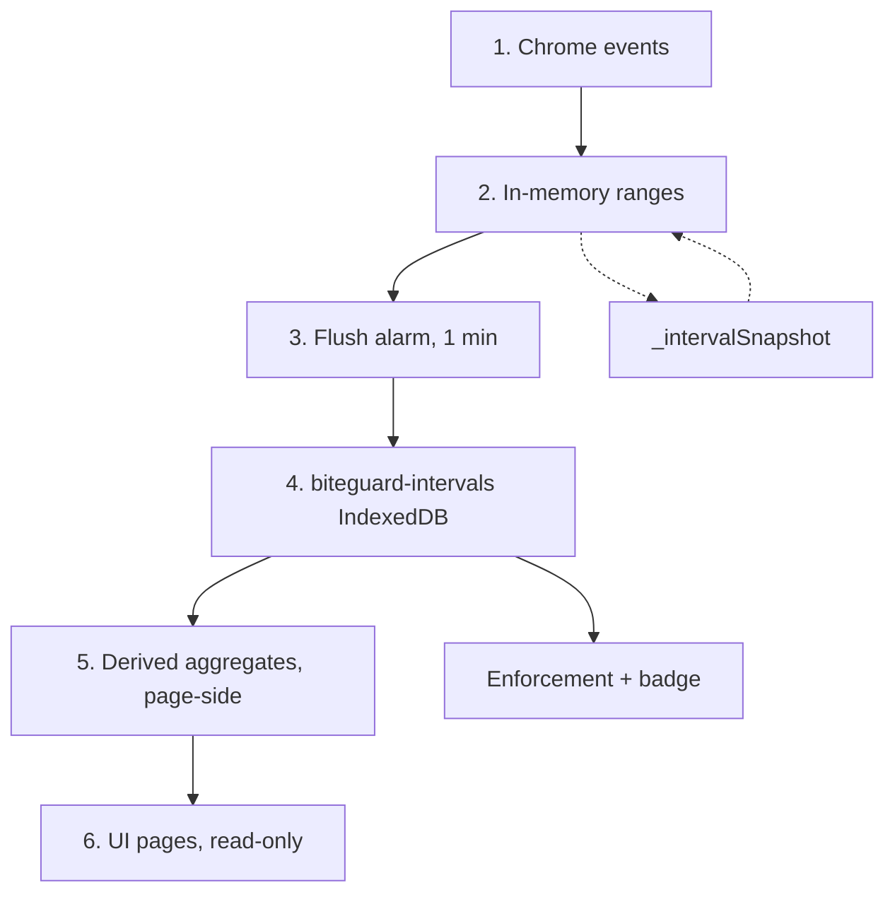
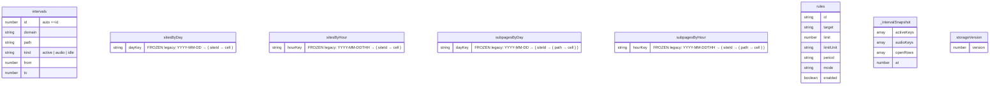

# Architecture

BiteGuard has two halves: **tracking** (track per-site and per-subpage time) and **enforcement** (block sites after a limit). Both are implemented. Tracking is an event-sourced aggregator; enforcement is a pure limit-checker (`computeOverage` in `enforcement.js`) that publishes `declarativeNetRequest` redirect rules to `blocked.html` (`publishOverage`).

Tracking is an *event-sourced aggregator* running in the background service worker. Chrome events mutate in-memory presence ranges, a 1-minute alarm flushes those ranges as rows to an IndexedDB log (`biteguard-intervals`), and UI pages derive their aggregates from the rows at read time. The UI is strictly read-only over tracking data; it never writes them. Time totals and visit counts are **not stored** — everything is derived from the interval rows.

## Tracking flow

1. **Chrome events** - `chrome.tabs`, `chrome.windows`, `chrome.webNavigation`, `chrome.idle`.
2. **In-memory ranges** - the live tracker (`intervalTracker.js`) keeps per-window/per-tab presence state keyed on `domain+path`; the range engine turns transitions into closed `[from, to)` ranges per `kind`.
3. **Flush alarm** - every 1 min `background.js` calls the tracker's `flushNow()`, which recovers from the snapshot, reconciles window/tab state, applies idle clipping, and writes the pending ranges as interval rows.
4. **`biteguard-intervals` IndexedDB** - one store, one row per closed range `{ domain, path, kind, from, to }`, `kind ∈ active|audio|idle`. `overlap` (= active ∩ audio) is **not** stored; nor are time totals or visit counts.
5. **Derived aggregates (page-side)** - `intervalAggregates.js` scans the rows and reconstructs the day/hour site and subpage shapes, visit counts, and the avg-per-clock-hour series. Nothing is pre-aggregated in storage.
6. **UI pages (read-only)** - `dashboard`, `site`, `path` read through `loadMergedTrackingData` (interval rows, stitched over frozen legacy buckets for pre-interval days). They never write tracking data.

`rules` is managed by the rules page and the popup, and is read by enforcement (background) and the rules page.

## Concepts

- **`siteId`** - eTLD+1 of a URL (via `siteResolution.js` / `tldts`).
- **`path`** - normalized URL path within a `siteId`.
- **interval row** - the only stored unit: `{ domain, path, kind, from, to }`. A closed presence range.
- **`kind`** - `active` (in the focused window), `audio` (audible, unmuted tab), or `idle` (the active portion clipped off once the user goes idle past the threshold).
- **`activeMs` / `audioMs`** - *derived* per-cell totals: the union of a domain's `active` / `audio` ranges within an hour (parallel same-site windows counted once), capped at one hour, summed into the day.
- **visits** - *derived*: the count of non-contiguous active intervals for a domain (abutting path ranges are one interval; a real gap splits it; `SESSION_GAP_MS` bridges sub-second seams). Within-site navigation doesn't bump it; leaving and returning does.
- **`dayKey`** - `YYYY-MM-DD` (local time).
- **`hourKey`** - `YYYY-MM-DDTHH` (local time).
- **stitch boundary** - `earliestDayKey()` is the first day with interval data. Days strictly before it read the frozen legacy buckets; that day and after read the interval log. Day/hour keys compare lexicographically = chronologically, so a plain string `<` is the split.
- **Snapshots** - the service worker can be killed at any moment. `_intervalSnapshot` persists the in-memory range state so time isn't lost between flushes.

## Storage schema

`intervals` lives in the `biteguard-intervals` IndexedDB (via Dexie). The four bucket maps, `rules`, `_intervalSnapshot` and `storageVersion` live in `chrome.storage.local`. The bucket maps are **frozen**: read-only legacy, no live writer.

### Ownership

| Key | Writers | Readers |
|---|---|---|
| `intervals` (IndexedDB) | background (interval tracker flush) | pages (via aggregates), background (enforcement / badge) |
| `rules` | popup, rules page | enforcement (background), rules page |
| `sitesByDay` / `sitesByHour` | import, migrations, seed | pages (stitch path), import/export |
| `subpagesByDay` / `subpagesByHour` | import, migrations | pages (stitch path), import/export |
| `_intervalSnapshot` | background | background |
| `storageVersion` | migrations | migrations |

## Page read path

The chrome message API is gone — pages read storage directly. The `QUERY_*` constants in `queryTypes.js` are **internal dispatch tags** for the merged reader (a leftover name from the old message API, now just read selectors).

Pages call `loadMergedTrackingData({ type: QUERY_*, ...args })` (`mergeDataSources.js`). It splits the request at `earliestDayKey()` and dispatches per day:

| Tag | Args | Returns | Purpose |
|---|---|---|---|
| `getSitesByDay` | - | `sitesByDay` map | full day-level history |
| `getSitesByHourToday` | - | today's hour buckets | today's hourly chart |
| `getSitesByHourForDay` | `dayKey` | that day's hour buckets | drill into a past day |
| `getAvgPerClockHour` | `siteIds?`, `range`, `dayKeys?` | `number[24]` | average ms per clock hour over a range |
| `getSubpagesByDay` | - | `subpagesByDay` map | path-level history |
| `getSubpagesByHour` | - | `subpagesByHour` map | path-level hourly history |

Interval days resolve through `intervalFetch` (IndexedDB, via `intervalAggregates`); pre-interval days through `bucketFetch` (`chrome.storage.local`). In mock mode (guided tour) fixtures are returned alone; when the log is empty every read falls through to buckets. Enforcement and the badge skip this reader and call `usageSince(windowStart)` directly for a light, uncached windowed aggregate.

## Enforcement

Implemented in `enforcement.js`, driven from `background.js`. `computeOverage(rules, stores, now)` is **pure**: for each enabled rule it sums usage over the period window (`hour`/`day`/`week`) under the rule's mode (`active` / `audio` / `active+audio`), and returns the over-limit and approaching (≥80%) sets. `publishOverage` reconciles `declarativeNetRequest` dynamic rules against the overage set, redirects matching open tabs to `blocked.html` (preserving the original URL for unblock), returns tabs when a limit resets, and counts blocks into `blocksByDay`. Rule match types: `host`, `subdomain`, `pathPrefix`, `regex`, `keyword`.

`computeOverage` is pure and shape-driven, so its data source is swappable. Post-cutover it reads `usageSince(enforcementWindowStart(now))` from the interval log instead of the scalar buckets, with no logic change. The flush alarm runs `flushNow()` then `checkEnforcement()` in sequence so enforcement never reads pre-flush usage; a pre-emptive `webNavigation.onBeforeNavigate` drain re-checks limits before the next tick.

## Modules

| Layer | File | Role |
|---|---|---|
| Background wiring | `src/background/background.js` | favicon cache, badge, the single 1-min `flush` alarm, enforcement check, pre-emptive block |
| Live tracker | `src/background/intervalTracker.js` | self-registers tab/window/SPA/idle listeners; configures the engine with a composite `domain+path` key and `_intervalSnapshot`; exports `flushNow()` and the raw `flushToStorage` drain |
| Range engine | `src/background/intervalTrackingUtils.js` | generic presence-range state machine (`createTrackingModule` + `createRangeTracker`); snapshot/recover, idle clip; `flushToStorage` writes interval rows |
| Interval store | `src/data/intervalLog.js` | the `biteguard-intervals` IndexedDB; row CRUD, `allIntervals`, `intervalsSince`, `intervalStats` |
| Derived aggregates | `src/data/intervalAggregates.js` | reconstructs day/hour site & subpage shapes, visits, avg-per-hour from rows; `usageSince`, `earliestDayKey` |
| Merged reader | `src/data/mergeDataSources.js`, `intervalProvider.js`, `bucketProvider.js` | page-side read; stitches interval days over frozen buckets |
| URL resolution | `src/background/siteResolution.js` | `siteIdFromUrl`, `pathFromUrl` |
| Debug | `src/background/trackingDebug.js` | `dbg` / `initDebug` / `isDebug`, gated on `_debug` |
| Enforcement | `src/background/enforcement.js`, `badge.js` | `computeOverage`, `publishOverage`, toolbar badge |
| Legacy bucket keys | `src/data/bucketKeys.js` | storage-key constants for the frozen scalar tier |
| Data utilities | `src/data/migrations.js`, `importBuckets.js`, `ttImport.js`, `exportPayload.js`, `prune.js`, `seedTestData.js`, `csvExport.js` | schema migrations, import/export, pruning |
| UI views | `src/pages/{dashboard,site,path,rules,popup,blocked,storage-management,...}` | tracking views (read-only) + rule editor |
| UI shared | `src/shared/*.js` | charts, drilldowns, formatting, theme |
