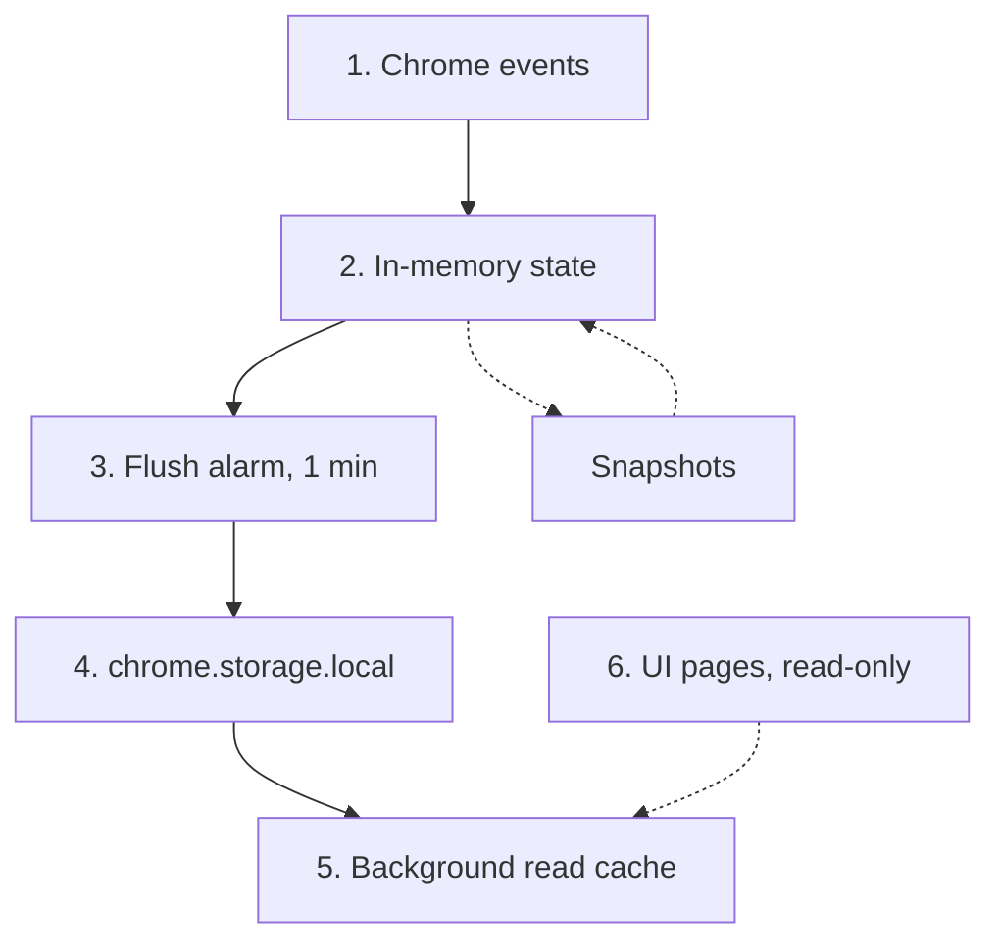
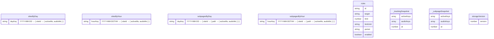

# Architecture

BiteGuard has two halves: **tracking** (track per-site and per-subpage time) and **enforcement** (block sites after a limit). Only the tracking half is implemented today - see [Gaps](#gaps).

Tracking is an *event-sourced aggregator* running in the background service worker. Chrome events mutate in-memory state, a 1-minute alarm flushes aggregates to `chrome.storage.local`, and UI pages read those aggregates back via `chrome.runtime.sendMessage`. The UI is strictly read-only over tracking data; it never writes them.

## Tracking flow

1. **Chrome events** - `chrome.tabs`, `chrome.windows`, `chrome.webNavigation`.
2. **In-memory state** - `windowSite`, `windowPath`, `audibleTabs` maps kept by the service worker. Persisted to `_trackingSnapshot` / `_subpageSnapshot` so this state survives service-worker restarts (the *snapshot* / *recover* dotted edges).
3. **Flush alarm** - every 1 min, accumulate `activeMs` and `audioMs` from the in-memory state into per-day / per-hour aggregates.
4. **`chrome.storage.local`** - persistent aggregates: `sitesByDay`, `sitesByHour`, `subpagesByDay`, `subpagesByHour`.
5. **Background read cache** - `cachedByDay`, `cachedByHour`, etc. In-memory per-handler cache, invalidated after each flush.
6. **UI pages (read-only)** - `dashboard`, `site`, `path` request aggregates over `chrome.runtime.sendMessage`. They never write to tracking data.

`rules` (popup-managed) is **outside this flow** - it has no readers yet.

## Modules

| Layer | File | Role |
|---|---|---|
| Event handlers + message router | `src/background/background.js` | wires chrome events to tracking modules; serves data queries from cache |
| Tracking engine | `src/background/trackingUtils.js` | generic per-key time accumulator (`createTrackingModule` + `createRangeTracker`); handles in-memory state, snapshots, flush |
| Tracking adapter (site-level) | `src/background/siteTracking.js` | configures the engine with `urlToKey = siteIdFromUrl` and a flat `byDay[dayKey][siteId]` shape |
| Tracking adapter (subpage-level) | `src/background/subpageTracking.js` | configures the engine with a composite `siteId+path` key and a nested `byDay[dayKey][siteId][path]` shape |
| URL resolution | `src/background/siteResolution.js` | `siteIdFromUrl`, `pathFromUrl` |
| Data utilities | `src/data/migrations.js`, `importData.js`, `seedTestData.js` | versioned schema migrations + import/export |
| UI views | `src/pages/{dashboard,site,path,popup,blocked}` | tracking data views (read-only) + rule editor (popup) |
| UI shared | `src/shared/*.js` | charts, drilldowns, formatting, theme |

## Concepts

- **`siteId`** - eTLD+1 of a URL (via `siteResolution.js` / `tldts`).
- **`path`** - normalized URL path within a `siteId`.
- **`activeMs`** - milliseconds the site/path was in the focused window.
- **`audioMs`** - milliseconds the site/path had an audible, unmuted tab (counted independently of active).
- **`dayKey`** - `YYYY-MM-DD` (local time).
- **`hourKey`** - `YYYY-MM-DDTHH` (local time).
- **Snapshots** - the service worker can be killed at any moment. Snapshots persist the in-memory active/audible state so time isn't lost between flushes.

## Storage schema

### Ownership

| Key | Writers | Readers |
|---|---|---|
| `rules` | popup | popup *(no consumer yet - see [Gaps](#gaps))* |
| `sitesByDay` | background, importData, migrations | background, importData, migrations |
| `sitesByHour` | background, importData, migrations | background, importData, migrations |
| `subpagesByDay` | background, importData | background, importData |
| `subpagesByHour` | background, importData | background, importData |
| `_trackingSnapshot` | background | background |
| `_subpageSnapshot` | background | background |
| `storageVersion` | migrations | migrations |

## Message API

All messages go UI → background via `chrome.runtime.sendMessage`.

| Message | Args | Returns | Purpose |
|---|---|---|---|
| `getSitesByDay` | - | `sitesByDay` map | full day-level history |
| `getSitesByHourToday` | - | today's hour buckets | today's hourly chart |
| `getSitesByHourForDay` | `dayKey` | that day's hour buckets | drill into a past day |
| `getAvgPerClockHour` | `siteIds?`, `range`, `dayKeys?` | `number[24]` | average ms per clock hour over a range |
| `getSubpagesByDay` | - | `subpagesByDay` map | path-level history |
| `getSubpagesByHour` | - | `subpagesByHour` map | path-level hourly history |
| `invalidateSitesCache` | - | `true` | force background to drop cached reads (called by import / seed) |

## Gaps

- **Enforcement is mid-rewrite, not unplanned.** The previous enforcement system (`timeRecords`, `dailyRecords`, `checkAndBlock`, `resetPeriod`) was removed during the tracking redesign and has not been rebuilt. The tracking half now exposes all inputs the planned three blocking modes need (`activeMs`, `audioMs`, `overlapMs`). What's missing: a limit-checker in background, a `declarativeNetRequest` ruleset publisher, a `mode` field on each rule, and a redirect path to `blocked.html`. See [enforcement.md](enforcement.md) for the rebuild plan.
- **Seven message handlers in `background.js` each re-implement the same read-through cache.** A single generic `getCached(key)` would collapse them.
