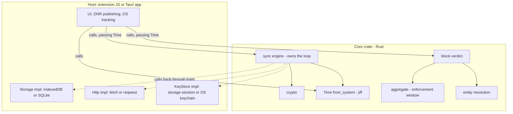

# Core crate

> TL;DR: one Rust crate compiled to **WASM** (extension) and **native** (Tauri apps). It owns every decision — crypto, the sync loop, entity resolution, the block verdict. Hosts implement three traits and write no logic.

**Why any of this:** [decisions.md](../appendix/roadmap-decisions.md) · **Crypto params:** [crypto-contract.md](../appendix/crypto-contract.md) · **Applies to v1b+**

## Boundary



Solid = host → core. Dotted = core calling back through traits. Nothing in the host
branches on sync state.

## Host traits

```rust
pub trait Storage {
    async fn dirty_rows(&self, limit: usize) -> Result<Vec<LocalRow>>;
    async fn mark_dirty(&self, ids: &[LocalId]) -> Result<()>;
    async fn clear_dirty(&self, ids: &[LocalId]) -> Result<()>;
    async fn upsert_mirror(&self, rows: Vec<MirrorRow>) -> Result<()>;
    async fn delete_local(&self, ids: &[LocalId]) -> Result<()>;
    async fn origins_page(&self, after: Option<Origin>, limit: usize) -> Result<Vec<Origin>>;
    async fn epoch_page(&self, below: u32, after: Option<Origin>, limit: usize) -> Result<Vec<Origin>>;
    async fn rows_since(&self, from_ms: i64) -> Result<Vec<Row>>;
    async fn meta_get(&self, key: MetaKey) -> Result<Option<Vec<u8>>>;
    async fn meta_set(&self, key: MetaKey, val: &[u8]) -> Result<()>;
}

pub trait Http {
    async fn send(&self, req: Request) -> Result<Response>;
}

Per-method purpose and bounds: [surface detail](../appendix/core-crate-surface.md).

**`origins_page` MUST return total order by `(device_id, local_id)`** — that ordering is what makes reconciliation a constant-memory merge-join instead of two full listings.

**Not traits:** time (core reads it via `jiff`, exposed as a `Time` snapshot) and randomness (`getrandom`).

## Exports

| Module | Exports | Pure |
|---|---|---|
| `crypto` | `generate_recovery`, `account_id_from_recovery`, `signing_key_from_recovery`, `recovery_kek_from_recovery`, `kek_from_passphrase`, `wrap_dek`/`unwrap_dek`, `encrypt_row`/`decrypt_row`, `encrypt_name`/`decrypt_name`, `sign_challenge`, `row_tag` | ✅ |
| `aggregate` | `union_len`, `cell_ms`, `hour_bounds`, `usage_since` | ✅ |
| `entity` | `resolve` → **`Vec<EntityId>`** (a row can count toward several entities) | ✅ |
| `enforce` | `compute_overage` | ✅ |
| `sync` | `SyncEngine::new`, `.tick`, `.register`, `.link_device`, `.unlock`, `.request_delete` | ❌ |

The pure set **is** the cross-target CI surface. `sign_challenge` does its own domain
separation, so no caller can sign a bare nonce.

```rust
pub struct SyncEngine<S: Storage, H: Http, K: KeyStore> { /* .. */ }

impl<S: Storage, H: Http, K: KeyStore> SyncEngine<S, H, K> {
    pub fn new(cfg: Config, storage: S, http: H, keys: K) -> Self;
    pub async fn tick(&mut self, time: &Time) -> Result<TickReport>;
}
```

**Generic, never `dyn`** — AFIT isn't object-safe, and generics are what let each target
monomorphize to its own `Send`-ness.

`Time` is a per-tick snapshot carrying `now_ms`, UTC offset transitions and `week_start`. Shape, why it is a struct, and why offsets rather than a zone name: [surface detail](../appendix/core-crate-surface.md).

## Sync tick

Full call sequence through the three traits: [surface detail](../appendix/core-crate-surface.md#sync-tick-in-full).


The host calls `Time::from_system`, passes it to `tick`, reads the report. It does not
decide what to push, when to stop paginating, or whether reconciliation is due.

**Reconciliation is a branch inside `tick`**, not an entry point: past 24h, compare
`row_digest`; on mismatch walk `/sync/ids` and `origins_page` together in the same order,
`delete_local` anything absent remotely, write `lastReconciledAt`.

**Errors, lifetime, config, constraints and CI:** [surface detail](../appendix/core-crate-surface.md).

## Not in the core

| Stays out | Lives in | Why |
|---|---|---|
| Dashboard aggregation (`build()`, visits, `wallByHour`, `getAvgPerClockHour`) | [intervalAggregates.js](../../src/data/intervalAggregates.js) | already shared — every client runs the same web UI |
| Block **action** (DNR, tab reload, Accessibility shield, process kill) | host | per-surface and OS-specific |
| Local DB schema, indexes, migrations | host | the contract governs the *wire* payload only |
| UI, i18n, charts | host | |
| OS tracking (foreground window, `UsageStats`, `sysinfo`) | host native | produces rows; the core consumes them |

The core takes the **verdict**, hosts take the **action**.

