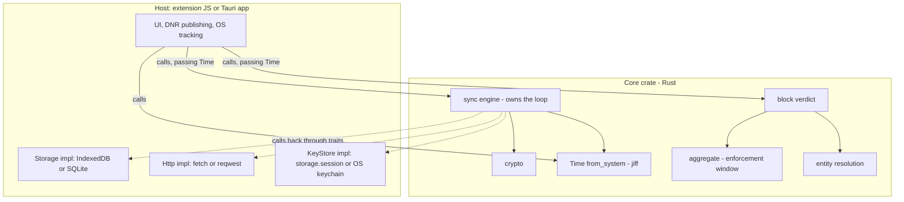
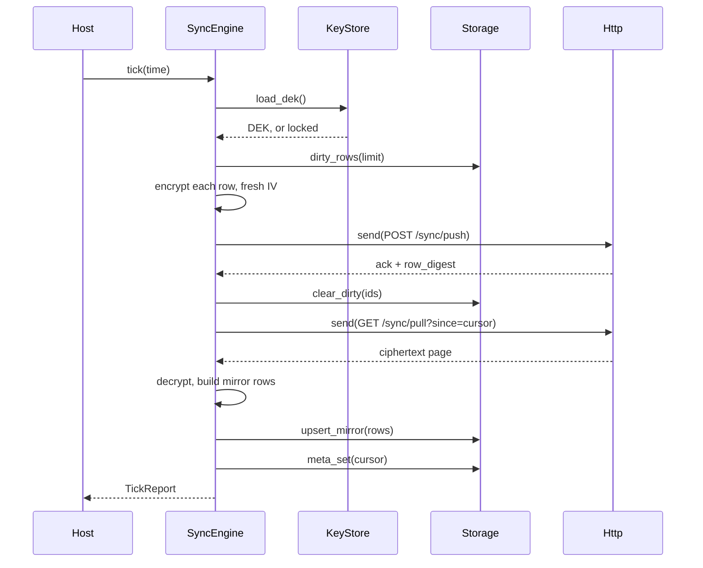

# Core crate

> One Rust crate → **WASM** (extension) + **native** (Tauri apps). It owns every
> decision: crypto, the sync loop, entity resolution, the block verdict. Hosts implement
> three traits and write no logic.

**Why any of this:** [decisions.md](decisions.md) · **Crypto params:** [crypto-contract.md](../features/cloud-sync/crypto-contract.md) · **Applies to v1b+**

## Boundary



Solid = host → core. Dotted = core calling back through traits. Nothing in the host
branches on sync state.

## Host traits

```rust
pub trait Storage {
    async fn dirty_rows(&self, limit: usize) -> Result<Vec<LocalRow>>;
    async fn mark_dirty(&self, ids: &[LocalId]) -> Result<()>;
    async fn clear_dirty(&self, ids: &[LocalId]) -> Result<()>;
    async fn upsert_mirror(&self, rows: Vec<MirrorRow>) -> Result<()>;
    async fn delete_local(&self, ids: &[LocalId]) -> Result<()>;
    async fn origins_page(&self, after: Option<Origin>, limit: usize) -> Result<Vec<Origin>>;
    async fn epoch_page(&self, below: u32, after: Option<Origin>, limit: usize) -> Result<Vec<Origin>>;
    async fn rows_since(&self, from_ms: i64) -> Result<Vec<Row>>;
    async fn meta_get(&self, key: MetaKey) -> Result<Option<Vec<u8>>>;
    async fn meta_set(&self, key: MetaKey, val: &[u8]) -> Result<()>;
}

pub trait Http {
    async fn send(&self, req: Request) -> Result<Response>;
}

pub trait KeyStore {
    async fn load_dek(&self) -> Result<Option<Dek>>;
    async fn store_dek(&self, dek: &Dek) -> Result<()>;
    async fn clear_dek(&self) -> Result<()>;
}
```

| Trait | Extension | Tauri | Exists because |
|---|---|---|---|
| `Storage` | IndexedDB | SQLite | genuinely different databases |
| `Http` | `fetch` | `reqwest` | transport only — the core builds the whole request |
| `KeyStore` | `storage.session` | OS keychain | **the DEK-at-rest tier is set by the crypto contract**, not convenience |

| Method | Serves | Bounded by |
|---|---|---|
| `dirty_rows` | push batch | `limit` |
| `mark_dirty` | claim-on-first-link | claim set |
| `clear_dirty` | push ack | the batch |
| `upsert_mirror` | applying a pulled page | the page |
| `delete_local` | remote deletions, dead-epoch rows | the page |
| `origins_page` | reconciliation diff (identities only) | `limit` |
| `epoch_page` | dead ciphertext after a DEK reset | `limit` |
| `rows_since` | enforcement window, nothing else | one calendar week, by policy |
| `meta_*` | engine scalars (cursor, `lastReconciledAt`, `_deviceId`, `account`, `wrappedSigningKey`, `wrappedRecovery`, `wrappedKeyCache`, `deviceRegistry`) | one value |

**`origins_page` MUST return total order by `(device_id, local_id)`** — that ordering is
what makes reconciliation a constant-memory merge-join instead of two full listings.

**Not traits:** time (core reads it via `jiff`) and randomness (`getrandom`).

## Exports

| Module | Exports | Pure |
|---|---|---|
| `crypto` | `generate_recovery`, `account_id_from_recovery`, `signing_key_from_recovery`, `recovery_kek_from_recovery`, `kek_from_passphrase`, `wrap_dek`/`unwrap_dek`, `encrypt_row`/`decrypt_row`, `encrypt_name`/`decrypt_name`, `sign_challenge`, `row_tag` | ✅ |
| `aggregate` | `union_len`, `cell_ms`, `hour_bounds`, `usage_since` | ✅ |
| `entity` | `resolve` → **`Vec<EntityId>`** (a row can count toward several entities) | ✅ |
| `enforce` | `compute_overage` | ✅ |
| `sync` | `SyncEngine::new`, `.tick`, `.register`, `.link_device`, `.unlock`, `.request_delete` | ❌ |

The pure set **is** the cross-target CI surface. `sign_challenge` does its own domain
separation, so no caller can sign a bare nonce.

```rust
pub struct SyncEngine<S: Storage, H: Http, K: KeyStore> { /* .. */ }

impl<S: Storage, H: Http, K: KeyStore> SyncEngine<S, H, K> {
    pub fn new(cfg: Config, storage: S, http: H, keys: K) -> Self;
    pub async fn tick(&mut self, time: &Time) -> Result<TickReport>;
}
```

**Generic, never `dyn`** — AFIT isn't object-safe, and generics are what let each target
monomorphize to its own `Send`-ness.

## `Time`

```rust
pub struct Time {
    pub now_ms: i64,
    pub offsets: Vec<(i64, i32)>,   // (effective_from_ms, offset_ms)
    pub week_start: Weekday,
}

impl Time { pub fn from_system(week_start: Weekday, window_start_ms: i64) -> Self; }

pub fn hour_bounds(from_ms: i64, to_ms: i64, time: &Time) -> Vec<HourSeg>;
pub fn usage_since(rows: &[Row], window_start_ms: i64, time: &Time) -> Usage;
pub fn compute_overage(rules: &[Rule], usage: &Usage, time: &Time) -> Overage;
```

Every limit window is **local wall-clock**, but rows store epoch ms. The shipped JS reads
three things off the ambient environment; all three are explicit here:

| Was implicit | Where |
|---|---|
| current time | `Date.now()` defaulted in `computeOverage` ([enforcement.js:106](../../src/background/enforcement.js#L106)) |
| local timezone | `setHours` / `getHours` ([intervalAggregates.js:22-31](../../src/data/intervalAggregates.js#L22-L31), [timeUtils.js:16-23](../../src/shared/timeUtils.js#L16-L23)) |
| `weekStart` | runtime-mutable pref with an `onChanged` listener ([weekStart.js:13-24](../../src/shared/weekStart.js#L13-L24)) |

- **A per-tick snapshot** — built fresh, thrown away. Not state, not config.
- **Offsets, not a zone name, and not a scalar.** A week can span a DST transition, so
  the offset varies *by instant*. Milliseconds, never whole hours — Nepal is `+05:45`,
  Lord Howe shifts 30 minutes. Give the first entry an open-ended lower bound.

## Sync tick



The host calls `Time::from_system`, passes it to `tick`, reads the report. It does not
decide what to push, when to stop paginating, or whether reconciliation is due.

**Reconciliation is a branch inside `tick`**, not an entry point: past 24h, compare
`row_digest`; on mismatch walk `/sync/ids` and `origins_page` together in the same order,
`delete_local` anything absent remotely, write `lastReconciledAt`.

## Errors

Split on one question: *could the tick proceed?*

**Outcomes** → `TickReport { pushed, pulled, deleted_local, reconciled, undecryptable }`.
`undecryptable` is **expected** after a DEK reset, not a failure — the tick still
succeeds.

**Failures** → `CoreError`, one variant per distinct host response:

| Variant | Host's only job |
|---|---|
| `Locked` | prompt for the passphrase |
| `NeedsReauth` | run sign-in |
| `NeedsRekey { current_epoch }` | prompt re-unlock against the new epoch |
| `Transport(String)` | **nothing** — the next alarm retries |
| `Storage(String)` | surface; usually quota |
| `Protocol(String)` | surface; bug or version skew |

`#[non_exhaustive]`. The `String`s are for display only — **never branch on them**;
anything worth branching on earns a variant. Retry and backoff are the core's, which is
why `Transport` is informational.

## Lifetime

| Host | Engine |
|---|---|
| Extension | **construct per tick** — the MV3 service worker is torn down when idle, so nothing outlives it anyway; WASM module instantiation is paid on SW startup either way |
| Tauri | one in app state — long-lived process, same core code |

## Config

Plain data to `SyncEngine::new`: `client_type` (`web`/`app`/`desktop`, the `source` tag),
base URL, push batch size, pull page size, reconcile interval. Values:
[operational defaults](../features/cloud-sync/cloud-sync.md#operational-defaults).

No retention age — nothing is auto-pruned. `Time` is not here either: `week_start`
changes while the app runs.

## Not in the core

| Stays out | Lives in | Why |
|---|---|---|
| Dashboard aggregation (`build()`, visits, `wallByHour`, `getAvgPerClockHour`) | [intervalAggregates.js](../../src/data/intervalAggregates.js) | already shared — every client runs the same web UI |
| Block **action** (DNR, tab reload, Accessibility shield, process kill) | host | per-surface and OS-specific |
| Local DB schema, indexes, migrations | host | the contract governs the *wire* payload only |
| UI, i18n, charts | host | |
| OS tracking (foreground window, `UsageStats`, `sysinfo`) | host native | produces rows; the core consumes them |

The core takes the **verdict**, hosts take the **action**.

## Constraints

1. **Generics only, never `dyn Storage`** — AFIT is not object-safe.
2. **No `!Send` value held across an `await`** in core code, or the native `tick` future
   stops being `Send` and Tauri's `spawn` rejects it.
3. **MSRV 1.75** (AFIT).

## CI

Golden vectors + **cross-target round-trip** (wasm32↔native, both directions) — see
[crypto-contract](../features/cloud-sync/crypto-contract.md#ci). The three traits get
in-memory fakes; time needs no fake, since a literal `Time` makes window, DST and
reconcile-gate tests deterministic.

## Open

None. Prerequisite work is tracked in [dev-plan.md](dev-plan.md).
