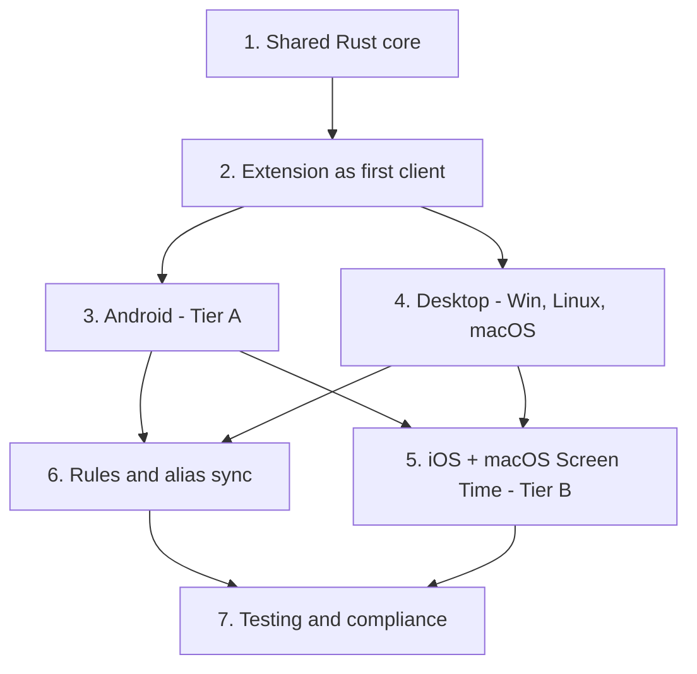

# Dev plan

> TL;DR: order of work in seven phases, from the shared Rust core to store compliance. The **what and why** live in [multiplatform.md](multiplatform.md) and [decisions.md](../appendix/roadmap-decisions.md).

Phases 3 and 4 are independent of each other; both need 2. Phase 6 is what makes combined
limits actually work across devices.

## 1 · Shared Rust core

Surface is specified in [core-crate.md](core-crate.md) — not repeated here.

| | |
|---|---|
| Core crate | crypto (`argon2`, `aes-gcm`, `bip39`, `hkdf`, `ed25519-dalek`), sync engine, enforcement-window aggregation, entity resolution, block verdict |
| Host traits | `Storage`, `Http`, `KeyStore` + in-memory fakes. Time is not a trait — `Time::from_system` via `jiff` |
| Binding shims | `wasm-bindgen` (extension) + Tauri native backend. **No logic in the shims** |
| CI | golden vectors + **cross-target round-trip decrypt** (a crypto-contract MUST) |

## 2 · Extension as first client

| | |
|---|---|
| Swap to the core | replace the JS crypto/sync path with the WASM core |
| Account UI | create account, link device via recovery phrase, passphrase set/unlock, device registry, sync status. **No email anywhere** |
| Firefox port | declare both `background.service_worker` + `background.scripts`; event-page path for the SW-based background; DNR vs webRequest parity; AMO packaging |

## 3 · Android (Tier A)

| | |
|---|---|
| Tracking | **foreground service** reading `UsageStats` — not a bare poll, which Doze kills. Emits `source: app` |
| Permissions | guide to Usage Access; runtime permissions via Tauri's flow |
| App-block | `AccessibilityService`: on foreground change ask the core for the verdict, shield if over |
| Web-block | optional `VpnService` DNS filter — note the single-VPN-slot conflict |
| Anti-tamper | Device Admin anti-uninstall only if Play's category permits; restart the service if killed |
| Play policy | parental-control category + declaration, not a listing paragraph |

## 4 · Desktop — Windows, Linux/X11, macOS

| | |
|---|---|
| Tracking | `sysinfo` + per-OS foreground: `_NET_ACTIVE_WINDOW` (X11), `windows` crate, `NSWorkspace` (macOS). Emits `source: desktop`; browsers as a **visible fallback entity** |
| Blocking | process suspend/kill; web via `hosts` / WFP / nftables. Needs admin/root |
| macOS | foreground tracking is public API; blocking needs a **non-sandboxed Developer-ID app** + `NEFilterDataProvider` (**defer past v1**) |
| Wayland | foreground query blocked — degrade tracking, keep network-layer web-block |
| **Also here** | the **Linux WebKitGTK spike** (real charts + timeline × NVIDIA/AMD/Intel × X11/Wayland) — it gates how much UI work is safe to build on the Tauri bet |

## 5 · iOS + macOS Screen Time (Tier B)

| | |
|---|---|
| Real APIs | `FamilyControls` (authorization, opaque `ApplicationToken`), `DeviceActivity` (threshold callbacks), `ManagedSettings`/`ManagedSettingsUI` (shield) |
| Consumer, not producer | opaque tokens ⇒ iOS **cannot emit `app:` rows**. It pulls the merged log and shields against its own token map |
| Unentitled fallback | self-usage + read-only cross-device views |

## 6 · Rules / alias sync

Combined cross-platform limits need rules + aliases consistent on every device.
Cloud-sync v1 syncs only the interval log. This **inherits the full E2E crypto
contract** — not plain settings sync. See
[entity-model dependencies](../features/entity-model.md#dependencies).

## 7 · Testing & compliance

| | |
|---|---|
| Functional | blocking latency; 24h battery; offline convergence; combined-limit correctness (**union**, not duration-sum) |
| Security | crypto-contract CI; nothing but ciphertext leaves the device; webview surface on Linux |
| Stores | Play (category + Accessibility/VPN justification); Apple (Family Controls entitlement; **Developer-ID-only** for macOS); AMO for Firefox |

## Prerequisite (shipped product)

Cloud-sync assumes the extension is **interval-first**. The bucket→interval migration must finish first:

- tracking cutover
- every dashboard and drilldown
- all user data actions — export/import, CSV, prune, targeted delete, storage health
- enforcement reading interval usage

Spec: [bucket→interval migration](../appendix/tracking-bucket-to-interval-migration.md).

Path-level aggregation in <code>intervalAggregates.js</code> — once listed as the first task — <strong>already landed</strong> (verified 2026-08-02). Re-check the rest of that list before assuming anything else is still open.
