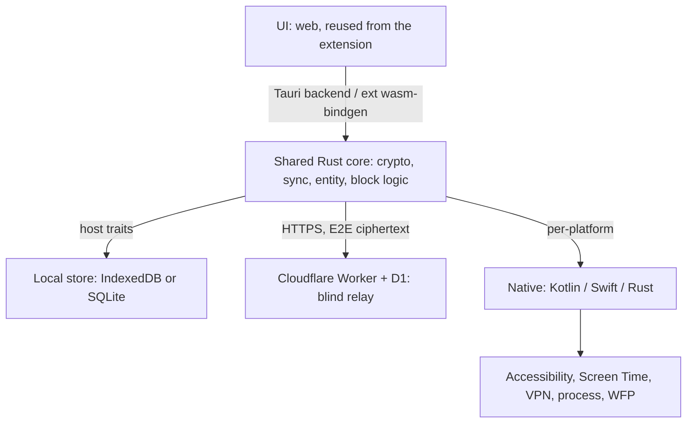

# Multiplatform

> TL;DR: extend Reeflect to Android / iOS / Windows / Linux / macOS plus the extension, all sharing one end-to-end-encrypted data set. Shared **Rust core**, **Tauri** UI, native code only for per-platform tracking and enforcement.

**Why Rust / why Tauri:** [decisions.md](../appendix/roadmap-decisions.md) · **Order of work:** [dev-plan.md](dev-plan.md) · **Core surface:** [core-crate.md](core-crate.md)

## Shape

| Layer | Tech |
|---|---|
| Shared core | **Rust** → WASM (extension) + native (apps) |
| UI | **Tauri** — the extension's web UI, reused |
| Core↔UI | Tauri native backend (no FFI bridge); `wasm-bindgen` in the extension |
| Backend | Cloudflare Worker + D1 |
| Local store | IndexedDB (extension) / SQLite (apps) |
| Android native | Kotlin — foreground service, Accessibility, VpnService |
| Apple native | Swift — `FamilyControls`/`DeviceActivity`/`ManagedSettings`; macOS `NEFilterDataProvider` |
| Desktop native | Rust — `sysinfo`, process control, hosts/WFP/nftables |

## Platform capability matrix

✅ full · ⚠️ limited · ❌ blocked. **Tier A** ships full features; **Tier B** is degraded.

**The Rust core is platform-agnostic — every cell below is tracking/enforcement
integration, not the core.**

| Platform | Tier | Track | App-block | Web-block | Privilege | Native | Distribution |
|---|---|---|---|---|---|---|---|
| **Android** | A | ✅ UsageStats ¹ | ✅ Accessibility ² | ✅ VpnService ³ | usage-access, accessibility, VPN | Kotlin | Play — policy risk ² |
| **iOS** | B | ⚠️ opaque ⁴ | ⚠️ ManagedSettings ⁵ | ⚠️ ManagedSettings ⁵ | Family Controls (Apple-gated) | Swift | App Store |
| **Windows** | A | ✅ Rust ⁶ | ✅ kill/suspend ⁷ | ✅ hosts / WFP ⁸ | Administrator | none | direct / MSIX |
| **Linux · X11** | A | ✅ `_NET_ACTIVE_WINDOW` | ✅ signals ⁹ | ✅ nftables / hosts | root (web) | none | direct / Flatpak |
| **Linux · Wayland** | B | ❌ blocked ¹⁰ | ⚠️ pid-only ¹⁰ | ✅ nftables / hosts | root + portal | none | direct / Flatpak |
| **macOS** | B | ✅ NSWorkspace ¹¹ | ⚠️ hard ¹² | ⚠️ NEFilter ¹³ | TCC + NE + admin | Swift | **NOT App Store** ¹² |
| **Ext · Chromium** | A | ✅ web only ¹⁴ | ❌ browser-scoped | ✅ DNR only ¹⁵ | none | none | Chrome Web Store |
| **Ext · Firefox** | A | ✅ web only ¹⁴ | ❌ browser-scoped | ✅ DNR *or* webRequest ¹⁵ | none | none ¹⁶ | **AMO** = addons.mozilla.org |
| **Ext · Firefox Android** | A ¹⁷ | ✅ web only ¹⁴ | ❌ browser-scoped | ✅ webRequest / DNR ¹⁵ | none | none | AMO |

Footnotes 1–17, the WebKitGTK risk register, and verified Tauri capability state: [platform notes](../appendix/multiplatform-platform-notes.md).

**Locked now:**

- iOS + Wayland are **consumers, not producers** — pull the merged log, best-effort
  block, promise no usage data upstream.
- **macOS: Developer ID + notarization only, never the Mac App Store.**
- Play needs a real policy strategy (parental-control category), not a listing paragraph.

## UI toolkit — **DECIDED: Tauri** (2026-07-29)

Fixed fact: the extension is DOM/HTML/CSS/JS and always will be. **Flutter cannot render
inside an extension**, so "share UI with the extension" is impossible under Flutter.

| | **Flutter** | **Tauri** | **Electron** |
|---|---|---|---|
| Existing UI | **rebuild in Dart** (11 pages, ~14 components, charts, i18n) | **~80% reuse** across extension + apps | ~80% reuse, **desktop only** |
| Ongoing | **two codebases forever** | one web UI | one, but desktop-only |
| Rust core | via `flutter_rust_bridge` (FFI) | **native — Rust IS the backend** | native addon or WASM |
| Native bridges | mature Android plugins | write yourself | desktop-only |
| Rendering | own renderer, pixel-identical | **per-OS webview** — WebKitGTK weak on Linux | bundled Chromium, consistent |
| Mobile | ✅ mature | ⚠️ GA Oct 2024 | ❌ **none** |
| Size | moderate | tiny | ❌ **~150 MB** |

### Engine matrix consequence

The shared web UI must survive **Blink** (Chromium ext) + **Gecko** (Firefox ext) +
**WebKit** (Tauri macOS/Linux) + **WebView2** (Tauri Windows). Firefox both reinforces
the reuse case and widens the test matrix to three engine families.

## Risks

| Risk | Impact | Mitigation |
|---|---|---|
| Play rejection (Accessibility + Device Admin) | High | Parental-control category + policy justification; minimize permissions |
| iOS opaque Screen Time | High | Scope iOS to consumer/shield-only; market Android/Windows/Linux first |
| macOS distribution | High | Developer ID only; defer `NEFilterDataProvider` past v1 |
| WebKitGTK on Linux | Med-High | Flatpak + env-vars + early spike |
| Crypto interop across targets | High | One core; cross-target round-trip decrypt in CI |
| Battery (foreground service) | Medium | Tune intervals; required on Android regardless |
| Elevated privilege (desktop) | Medium | Clear installer step explaining why |
| Firefox engine divergence | Medium | Event-page path + DNR/webRequest parity; AMO packaging |
