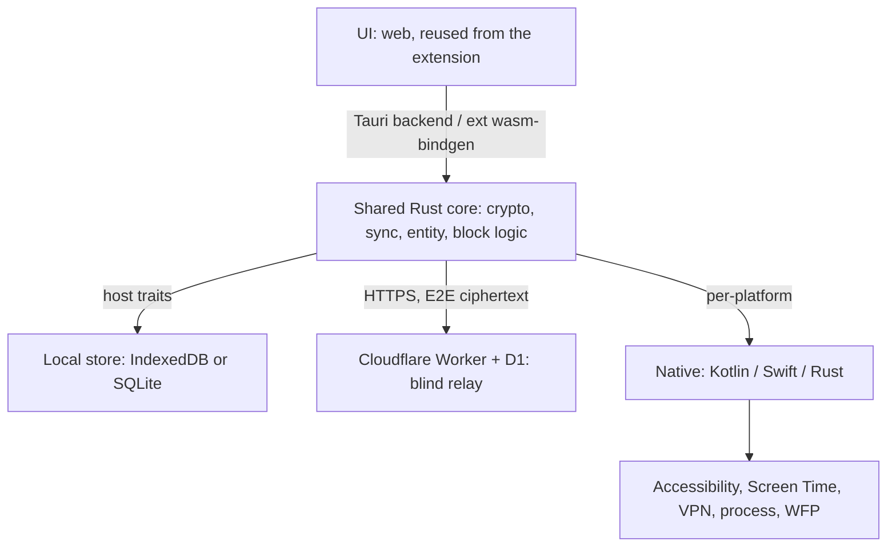

# Multiplatform

> Coral Clock from one extension to a cross-platform suite sharing **one account and one
> E2E data set**. Shared **Rust core**, **Tauri** UI. Native code only for per-platform
> tracking and enforcement.

**Why Rust / why Tauri:** [decisions.md](decisions.md) · **Order of work:** [dev-plan.md](dev-plan.md) · **Core surface:** [core-crate.md](core-crate.md)

## Shape

| Layer | Tech |
|---|---|
| Shared core | **Rust** → WASM (extension) + native (apps) |
| UI | **Tauri** — the extension's web UI, reused |
| Core↔UI | Tauri native backend (no FFI bridge); `wasm-bindgen` in the extension |
| Backend | Cloudflare Worker + D1 |
| Local store | IndexedDB (extension) / SQLite (apps) |
| Android native | Kotlin — foreground service, Accessibility, VpnService |
| Apple native | Swift — `FamilyControls`/`DeviceActivity`/`ManagedSettings`; macOS `NEFilterDataProvider` |
| Desktop native | Rust — `sysinfo`, process control, hosts/WFP/nftables |

## Platform capability matrix

✅ full · ⚠️ limited · ❌ blocked. **Tier A** ships full features; **Tier B** is degraded.

**The Rust core is platform-agnostic — every cell below is tracking/enforcement
integration, not the core.**

| Platform | Tier | Track | App-block | Web-block | Privilege | Native | Distribution |
|---|---|---|---|---|---|---|---|
| **Android** | A | ✅ UsageStats ¹ | ✅ Accessibility ² | ✅ VpnService ³ | usage-access, accessibility, VPN | Kotlin | Play — policy risk ² |
| **iOS** | B | ⚠️ opaque ⁴ | ⚠️ ManagedSettings ⁵ | ⚠️ ManagedSettings ⁵ | Family Controls (Apple-gated) | Swift | App Store |
| **Windows** | A | ✅ Rust ⁶ | ✅ kill/suspend ⁷ | ✅ hosts / WFP ⁸ | Administrator | none | direct / MSIX |
| **Linux · X11** | A | ✅ `_NET_ACTIVE_WINDOW` | ✅ signals ⁹ | ✅ nftables / hosts | root (web) | none | direct / Flatpak |
| **Linux · Wayland** | B | ❌ blocked ¹⁰ | ⚠️ pid-only ¹⁰ | ✅ nftables / hosts | root + portal | none | direct / Flatpak |
| **macOS** | B | ✅ NSWorkspace ¹¹ | ⚠️ hard ¹² | ⚠️ NEFilter ¹³ | TCC + NE + admin | Swift | **NOT App Store** ¹² |
| **Ext · Chromium** | A | ✅ web only ¹⁴ | ❌ browser-scoped | ✅ DNR only ¹⁵ | none | none | Chrome Web Store |
| **Ext · Firefox** | A | ✅ web only ¹⁴ | ❌ browser-scoped | ✅ DNR *or* webRequest ¹⁵ | none | none ¹⁶ | **AMO** = addons.mozilla.org |
| **Ext · Firefox Android** | A ¹⁷ | ✅ web only ¹⁴ | ❌ browser-scoped | ✅ webRequest / DNR ¹⁵ | none | none | AMO |

Footnotes 1–17

1. Reliable background tracking needs a **foreground service** (persistent notification); a bare 60s poll dies to Doze.
2. Accessibility-for-blocking + Device Admin anti-uninstall = Play removal risk; needs the **parental-control category** + a policy declaration.
3. A local DNS-filter VPN occupies the **single** VPN slot — conflicts with the user's real VPN.
4. `DeviceActivity` yields threshold callbacks + opaque `ApplicationToken` only; **can't read per-app usage**.
5. `ManagedSettings` can shield apps / restrict web, but needs the Family Controls entitlement.
6. `sysinfo` + `windows` crate: foreground window + process, polled.
7. Kill/suspend by pid is crude — can't block one browser **tab**.
8. hosts file = trivially bypassed; WFP = robust but a whole subsystem.
9. `SIGSTOP`/`SIGKILL` work same-user; still need to know what's focused (fine on X11).
10. Wayland **deliberately** blocks querying focused/other windows; needs a compositor protocol or portal. Network-layer web-block still works.
11. `NSWorkspace.frontmostApplication` is public API; window/tab detail via Accessibility (`AXUIElement`, TCC grant).
12. App Sandbox forbids controlling other apps → must ship **non-sandboxed** (Developer ID + notarization), which **excludes the Mac App Store**.
13. `NEFilterDataProvider` System Extension: gated entitlement + notarization + user approval. **Defer past v1.**
14. Existing product: web intervals only, no app-level tracking. Runs on every desktop OS.
15. Chromium MV3 = **DNR only**. **Firefox keeps blocking `webRequest`** *and* has DNR. ([MDN](https://developer.mozilla.org/en-US/docs/Mozilla/Add-ons/WebExtensions/Intercept_HTTP_requests))
16. Chrome MV3 = **service worker**; **Firefox = no SW**, uses event pages. Declare **both** `background.service_worker` + `background.scripts`. The current SW-based `src/background/` needs an event-page path. ([MDN](https://developer.mozilla.org/en-US/docs/Mozilla/Add-ons/WebExtensions/manifest.json/background))
17. Firefox for Android supports WebExtensions → the **only mobile surface needing no native app**. **Firefox iOS = no WebExtensions** → dead end.

**Locked now:**

- iOS + Wayland are **consumers, not producers** — pull the merged log, best-effort
  block, promise no usage data upstream.
- **macOS: Developer ID + notarization only, never the Mac App Store.**
- Play needs a real policy strategy (parental-control category), not a listing paragraph.

## UI toolkit — **DECIDED: Tauri** (2026-07-29)

Fixed fact: the extension is DOM/HTML/CSS/JS and always will be. **Flutter cannot render
inside an extension**, so "share UI with the extension" is impossible under Flutter.

| | **Flutter** | **Tauri** | **Electron** |
|---|---|---|---|
| Existing UI | **rebuild in Dart** (11 pages, ~14 components, charts, i18n) | **~80% reuse** across extension + apps | ~80% reuse, **desktop only** |
| Ongoing | **two codebases forever** | one web UI | one, but desktop-only |
| Rust core | via `flutter_rust_bridge` (FFI) | **native — Rust IS the backend** | native addon or WASM |
| Native bridges | mature Android plugins | write yourself | desktop-only |
| Rendering | own renderer, pixel-identical | **per-OS webview** — WebKitGTK weak on Linux | bundled Chromium, consistent |
| Mobile | ✅ mature | ⚠️ GA Oct 2024 | ❌ **none** |
| Size | moderate | tiny | ❌ **~150 MB** |

### WebKitGTK risk (Linux, accepted)

| # | Issue | Severity |
|---|---|---|
| 1 | **Engine version + CVE patching distro-controlled** — no `minimumWebview2Version` equivalent | 🔴 HIGH |
| 2 | NVIDIA/DMABUF: blank window, flicker, crash-on-resize, **silent canvas slow-path** | 🔴 HIGH |
| 3 | Perf ceiling — Tauri's own figure: **40fps vs 240fps** | 🟠 MED-HIGH |
| 4 | WebKit lags Blink; Chromium-isms in shared UI can break | 🟡 MED |
| 5 | Wayland instability (`Gdk Error 71`) | 🟡 MED |
| 6 | DevTools / data-folder disclosure / IME | 🟢 LOW |

Keys live in Rust, **but decrypted history renders in the webview DOM** — so #1's patch
level is a security concern, not just a compat one.

**Mitigations:** ship Linux via **Flatpak** (pinned runtime — the single most important
one) · bake graphics env-vars into `main()` (`WEBKIT_DISABLE_DMABUF_RENDERER`,
`__NV_DISABLE_EXPLICIT_SYNC`) · compat-audit the UI on WebKit · **early Linux spike**
(real charts + timeline × NVIDIA/AMD/Intel × X11/Wayland) before committing UI work.
Sources: [linux-graphics](https://v2.tauri.app/develop/debug/linux-graphics/), [scope](https://v2.tauri.app/security/scope).

### Tauri state (verified 2026-07-29)

| Need | State |
|---|---|
| Mobile permission flow | ✅ `@TauriPlugin(permissions)` + `checkPermissions`/`requestPermissions` |
| Custom native bridges | ✅ templated Kotlin/Swift plugin workflow |
| Desktop autostart / tray | ✅ official plugins |
| **Background tracking (mobile)** | ⚠️ real work — **same in Flutter** |
| Linux engine | ⚠️ WebKitGTK; no Chromium today |

### Engine matrix consequence

The shared web UI must survive **Blink** (Chromium ext) + **Gecko** (Firefox ext) +
**WebKit** (Tauri macOS/Linux) + **WebView2** (Tauri Windows). Firefox both reinforces
the reuse case and widens the test matrix to three engine families.

## Risks

| Risk | Impact | Mitigation |
|---|---|---|
| Play rejection (Accessibility + Device Admin) | High | Parental-control category + policy justification; minimize permissions |
| iOS opaque Screen Time | High | Scope iOS to consumer/shield-only; market Android/Windows/Linux first |
| macOS distribution | High | Developer ID only; defer `NEFilterDataProvider` past v1 |
| WebKitGTK on Linux | Med-High | Flatpak + env-vars + early spike |
| Crypto interop across targets | High | One core; cross-target round-trip decrypt in CI |
| Battery (foreground service) | Medium | Tune intervals; required on Android regardless |
| Elevated privilege (desktop) | Medium | Clear installer step explaining why |
| Firefox engine divergence | Medium | Event-page path + DNR/webRequest parity; AMO packaging |
