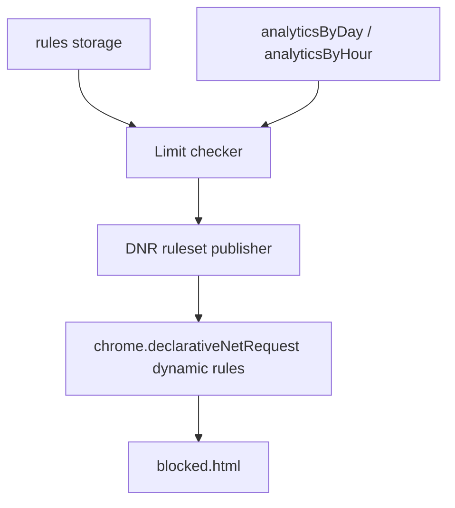

# Enforcement (planned)

## Status

The enforcement half of BiteGuard - blocking sites once they cross a configured limit - was implemented in an earlier iteration and **deliberately removed** during the tracking redesign. The legacy storage keys (`timeRecords`, `dailyRecords`) and legacy functions (`checkAndBlock`, `resetPeriod`) are gone. See [docs/archive/REDESIGN_ISSUES.md](archive/REDESIGN_ISSUES.md) for the removal context. Analytics has since been redesigned and is stable; enforcement is the next slot to rebuild.

## What's already in place

These don't need to change:

- `declarativeNetRequest` permission in [manifest.json:28](../manifest.json#L28).
- `src/pages/blocked/blocked.html` exposed as a web-accessible resource ([manifest.json:31-34](../manifest.json#L31-L34)).
- `rules` storage shape, written by [src/pages/popup/popup.js](../src/pages/popup/popup.js): `{id, target, limit, limitUnit, period, enabled}`.
- All three accumulators per site - `activeMs`, `audioMs`, `overlapMs` - in `analyticsByDay` / `analyticsByHour`. These are exactly the inputs the planned [three blocking modes](#three-blocking-modes) need (per [docs/archive/TRACKING_REDESIGN.md](archive/TRACKING_REDESIGN.md)).

## Missing pieces

1. **No reader of `rules` outside popup.** Background never sees them.
2. **No `mode` field on rules.** The popup doesn't ask which blocking mode a rule uses, even though analytics support all three.
3. **No limit checker** - nothing computes "site X has exceeded `rule.limit` over `rule.period`".
4. **No DNR ruleset publisher** - no `chrome.declarativeNetRequest.updateDynamicRules` call anywhere in the codebase. The permission is declared but unused.
5. **No redirect to `blocked.html`** - no DNR redirect rule, no `webNavigation` interceptor.

## Proposed architecture

1. **Limit checker** - runs at the end of each flush alarm (1 min) in `background.js`. For each enabled rule:
   - Compute the relevant period window (e.g. `period=day` -> today's `dayKey`; `period=hour` -> current `hourKey`; `period=week` -> last 7 `dayKey`s).
   - Apply the rule's `mode` formula on the aggregates over that window.
   - Compare to `rule.limit * unitMultiplier(rule.limitUnit)`.
   - Produce the **overage set**: list of `siteId`s currently over their limit (with which `rule.id`).
2. **DNR ruleset publisher** - diff the new overage set against the previously-published one. For added entries, register a dynamic DNR rule of the form *"redirect requests matching `rule.target` to `blocked.html?rule=<id>&site=<siteId>`"*. For removed entries (limit no longer exceeded - period rolled over, rule disabled), remove the matching rule. Use `chrome.declarativeNetRequest.updateDynamicRules`.
3. **Period boundaries** - when the local clock crosses an hour / day / week boundary the overage set may shrink (previous window's usage drops out). The flush alarm fires every minute regardless, so the checker picks this up on the next tick. No special boundary handler needed.
4. **Popup `mode` control** - add a dropdown to the add-form for `active` / `audio` / `active+audio`. Default to `active`. Existing rules without `mode` default to `active` on read.

### Three blocking modes

| Mode | Formula | Behavior |
|---|---|---|
| `active` | `activeMs` | Counts time the site was in the focused window. |
| `audio` | `audioMs` | Counts time the site had an audible, unmuted tab - regardless of focus. |
| `active+audio` | `activeMs + audioMs - overlapMs` | Union of both - useful for "background podcasts shouldn't count, but reading the article should." |

## Design decisions to resolve

- **Alarm-tick vs navigation-time checking.** Alarm tick (1 min) is simple but lets a tab cross the limit and stay open until the next flush. Adding a `webNavigation.onBeforeNavigate` short-circuit that consults a cached overage set is small and gives instant blocking on new tabs. Recommendation: alarm tick first, navigation hook second.
- **Pre-emptive vs reactive blocking within a flush window.** Reactive (block once the post-flush totals cross the limit) is one line of logic. Pre-emptive (predict crossing from in-memory tracker state and block before the flush) is more code. Recommendation: reactive.
- **Subdomain matching** - `*.reddit.com`. DNR `urlFilter` supports this natively. Defer to v2.
- **Path-scoped limits** - `reddit.com/r/foo`. Requires moving from domain-level to URL-filter DNR rules and consulting `subpagesByDay/Hour` instead of `analyticsByDay/Hour`. Defer to v2 (already noted in [docs/subpage-tracking/TODO.md](subpage-tracking/TODO.md)).
- **Rule uniqueness** - no two rules with same `(target, period)`. Validate in popup form on save.
- **Target validation** - reject malformed hostnames at save time. Listed in [docs/ideas/IDEAS.md](ideas/IDEAS.md).
- **Migration of existing `rules`** - if any users have stored rules without a `mode` field, the limit checker defaults to `mode='active'` on read. A migration in [src/data/migrations.js](../src/data/migrations.js) could backfill the field for cleanliness.

## Implementation order

Smallest shippable slice first:

1. **Add `mode` field to the rule schema** (popup form + storage migration). No behavior change yet.
2. **Limit checker** - pure function `computeOverage(rules, analytics, now) -> Map<ruleId, {siteId, overBy}>`. Unit-testable, no chrome APIs. Wire into the flush alarm but **don't publish** anywhere yet - just `console.log` for verification.
3. **DNR publisher** - diff overage sets, call `updateDynamicRules`. Targets only redirect to `blocked.html`. Verify in browser.
4. **`blocked.html` polish** - read query params (`rule`, `site`), show which limit was hit and when it resets.
5. **Navigation-time short-circuit** (optional v1.1) - `webNavigation.onBeforeNavigate` consults the cached overage set to block immediately rather than waiting for DNR re-evaluation.
6. **v2 work** - subdomain matching, path-scoped limits, rule uniqueness, target validation.

## References

- Previous enforcement design (since removed): [docs/archive/TRACKING_REDESIGN.md](archive/TRACKING_REDESIGN.md), [docs/archive/REDESIGN_ISSUES.md](archive/REDESIGN_ISSUES.md).
- Three blocking modes origin: [docs/ideas/IDEAS.md](ideas/IDEAS.md).
- Path-scoped limits hint: [docs/subpage-tracking/TODO.md](subpage-tracking/TODO.md).
- General feature ideas / open questions: [docs/ideas/IDEAS.md](ideas/IDEAS.md).
