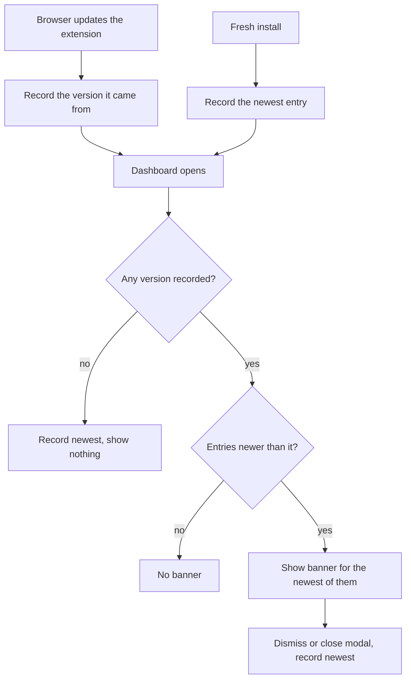

# Changelog popup

Tell returning users what changed after an update. On the dashboard, a
dismissable banner announces the new version; clicking it opens a modal
listing that release's changes, grouped into new features, bug fixes and
improvements. Independent of the [guided tour](guided-tour.md) — the tour
onboards first-time users, this surfaces release notes to existing ones.

## User stories

- As a returning user, I want a short summary of what changed after an
update so I notice new features without hunting through a repo.
- As a returning user, I want to dismiss that summary in one click so it
never blocks the dashboard.
- As a new user, I don't want a changelog on first install — there is no
"before" for me to compare against.
- As a user in Spanish or French, I want the changelog in my language.

## Acceptance criteria

- The banner appears on the dashboard only when there is at least one
entry newer than the user's `lastShownChangelogVersion`.
- The banner reads "What's new: <version>", using the newest unseen
entry's version, and carries a `Dismiss` control.
- Clicking the version opens a modal listing every unseen entry, newest
last, with category headings for each populated section.
- Dismissing the banner, or closing the modal by any route (`✕`,
backdrop click, `Esc`), marks the entries seen so neither returns.
- The modal sets `role="dialog"` and `aria-modal`, pins focus to its
close button while open, and restores the previously focused element on
close.
- A fresh install is seeded to the newest entry, so a new user sees no
banner.
- On update, the version the user came from is recorded, so they see the
notes for the release they just moved to — and for any release they
skipped along the way.
- An install with no recorded version and no update event to learn from
is treated as caught up rather than shown past releases.
- Bullet text renders in the resolved UI language, falling back to
English when a translation is missing.

## Scope

### Surfaces involved

| Surface    | Role in this feature                                                                     |
| ---------- | ---------------------------------------------------------------------------------------- |
| background | Records the seen version on install and on update, so the tour and changelog don't collide |
| dashboard  | Hosts the banner and the modal; the only surface that renders changelog content            |
| settings   | Shows the installed version with a link to that version's release notes on GitHub          |

### Files involved

| File                             | Role                                                                    |
| -------------------------------- | ----------------------------------------------------------------------- |
| `src/shared/changelog.js`        | Read/write the seen version, compare versions, compute unseen entries    |
| `src/shared/changelogEntries.js` | The authored entries, plus the category → message-key map                |
| `src/shared/changelog.css`       | Banner and modal styling, reusing the shared `modal-dialog` pattern      |
| `src/pages/dashboard/dashboard.js` | Renders the banner, builds the modal, handles focus and dismissal      |
| `src/pages/dashboard/dashboard.html` | `#changelog-subheader` banner markup                                  |
| `src/background/background.js`   | Seeds on install, and on update seeds from `details.previousVersion`     |
| `src/shared/i18n.js`             | `resolveLanguage()` resolves auto/explicit language for inline content   |

### Storage

One key in `chrome.storage.local`: `lastShownChangelogVersion` — the newest
release whose notes the user has already seen. Dismissing writes the newest
authored entry; an update writes the manifest version the user came from.
Those two are not the same number, so entries are selected by **comparing**
versions rather than matching one exactly. A release that authored no entry
therefore still resolves correctly instead of reading as an unknown value.

### Authoring an entry

Entries are ordered oldest → newest in `changelogEntries.js`. Bullet text
carries its own `{ en, es, fr }` inline rather than going through
`_locales/*/messages.json`, since per-release prose would accumulate there
forever, one-off and unreused. This exception is recorded in `CLAUDE.md`.
Category labels stay in `messages.json` as normal UI chrome. A bullet may
use `**bold**` for a lead-in label.

## Visibility rules

## Edge cases

- **Stored version with no entry of its own**: resolved by comparison, so
a user on a release that authored no entry still sees later ones.
- **Skipped releases**: updating across several versions shows every
entry newer than the one the user came from, not just the latest.
- **Missing translation**: `item[lang] ?? item.en` falls back to English
per bullet, not per entry.
- **Untrusted text**: bullet text is escaped before `**bold**` is applied,
so authored prose cannot inject markup.

## Versioning

An entry's version must equal the `manifest.json` version of the release
that ships it, and both are bumped in the same commit. Entries are
append-only: nothing is ever inserted below the newest one, because the
seen-version comparison assumes older entries never appear. The full
semver rules live in `CLAUDE.md` under Versioning and releases.
