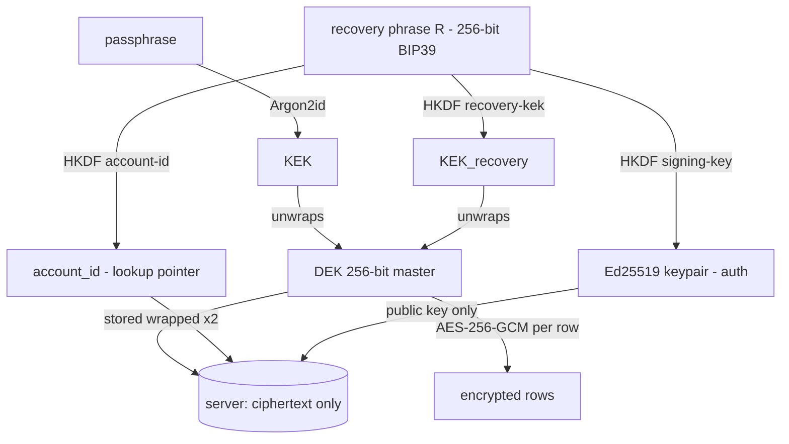
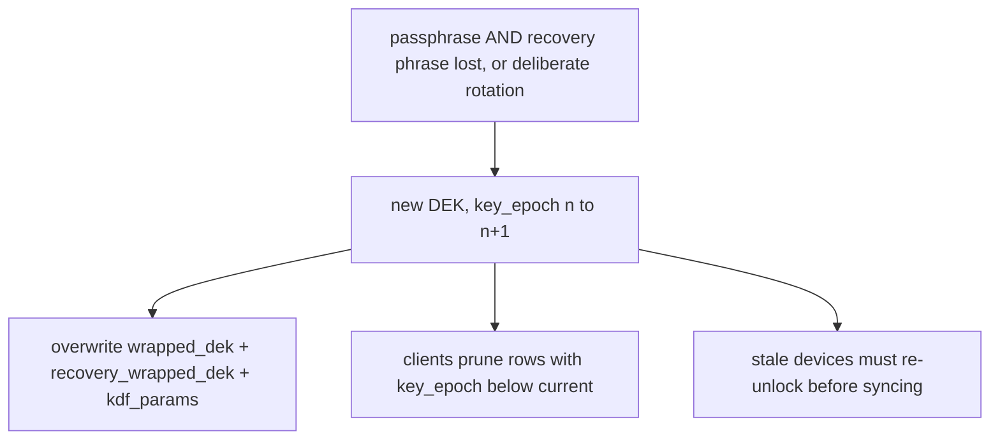

# Crypto contract (frozen)

> **Reference, not a read-through.** Precise parameters every client implements against.
> Deliberately textual: "96-bit IV, 128-bit tag" has no diagram form.
> Design context: [cloud-sync.md](cloud-sync.md) · Rationale: [decisions.md](../../architecture/decisions.md)

**One implementation.** All clients run the same Rust core — extension via WASM
(`wasm-bindgen`), mobile/desktop natively. No second (JS/WebCrypto) implementation, so
ciphertext is interchangeable by construction.

**Applies to v1b.** v1a is a pre-core opaque-JSON passthrough with no crypto to pin.

**Crates:** `argon2`, `aes-gcm`, `bip39`, `hkdf`, `ed25519-dalek`, `getrandom` (`js`
feature on `wasm32`), `jiff`. No `hash-wasm`, no WebCrypto.

## Key hierarchy



## Primitives

| Purpose | Primitive | Parameters |
|---|---|---|
| Row encryption | AES-256-GCM | 96-bit (12-byte) random IV per encryption; 128-bit tag. `interval_cipher` = `ciphertext‖tag`; `interval_iv` in its own column. AAD empty (locked). |
| DEK | 256-bit random | `getrandom` / `OsRng`. |
| Passphrase → KEK | Argon2id (RFC 9106, v `0x13`) | m = 65536 KiB (64 MiB), t = 3, p = 1, 32-byte output, 16-byte salt. Params + salt in `keys.kdf_params`. |
| Wrap DEK by KEK | AES-256-GCM | `wrapped_dek = iv(12)‖ct‖tag`, fresh 12-byte IV. |
| Recovery secret R | 256-bit random | BIP39 English 24 words (`from_entropy`/`to_entropy` only, never the PBKDF2 seed path). |
| R → KEK_recovery | HKDF-SHA256 | `salt` empty, `info` = `"coralclock/recovery-kek/v1"`, `L` = 32. |
| R → `account_id` | HKDF-SHA256 | `salt` empty, `info` = `"coralclock/account-id/v1"`, `L` = 32. |
| R → signing key | HKDF-SHA256 → Ed25519 | `salt` empty, `info` = `"coralclock/signing-key/v1"`, `L` = 32, used as the Ed25519 seed. |
| Recovery-wrap DEK | AES-256-GCM under KEK_recovery | `recovery_wrapped_dek = iv(12)‖ct‖tag`. |
| Auth signature | Ed25519 | signs `"coralclock/auth/v1" ‖ nonce`, never the bare nonce. |
| `row_tag` | SHA-256, first 16 bytes | over `"coralclock/row-tag/v1" ‖ device_id ‖ 0x00 ‖ local_id_le`. Client-computed. |
| `key_epoch` | integer | Current epoch in `keys.key_epoch`; every `intervals` row carries the epoch that encrypted it. |

`kdf_params`: `{"alg":"argon2id","v":19,"m":65536,"t":3,"p":1,"salt":"<base64>"}` (per-account, upgradable).

## Wire payload (version-tolerant)

Inside `interval_cipher`. Compact JSON, UTF-8. The server never parses it; each client's
**local** shape is its own concern.

```
{"v":1,"domain":<str>,"from":<int-ms>,"to":<int-ms>,"path":<str>,"kind":<str>,"source":<str>}
```

| Field | Required | Default | Notes |
|---|---|---|---|
| `v` | ✅ | — | payload version, integer |
| `domain` | ✅ | — | host / package / exe |
| `from`, `to` | ✅ | — | integer epoch **ms** — not float, not ISO |
| `kind` | ✅ | **never defaulted** | `active` \| `audio` \| `idle` |
| `path` | — | `""` | |
| `source` | — | `"web"` | `web` \| `app` \| `desktop` |

**Ignore unknown fields** (serde `#[serde(default)]`, no `deny_unknown_fields`) — new
optional fields are then migration-free *and* re-encryption-free.

<sub><code>kind</code> is never defaulted because the three are mutually exclusive measurements with no neutral value: a missing <code>kind</code> read as <code>"active"</code> would silently miscount an <code>audio</code> row.</sub>

## Normative MUSTs

1. **Fresh CSPRNG IV on every encryption**, including re-encrypting an open row. Never
   reuse the stored `interval_iv`, derive it from `localId`, or use a counter.
   <sub>Open rows re-dirty ~1×/min under the same DEK; IV reuse in GCM loses confidentiality <em>and</em> the auth key. Bound ≤ 2³² random-IV encryptions per key (NIST SP 800-38D).</sub>
2. **IV placement.** `interval_iv` is the row IV; `devices.name_iv` is the device-name
   IV — independent. The first 12 bytes of `wrapped_dek` / `recovery_wrapped_dek` are
   *that blob's own* embedded IV. Do not strip 12 bytes off `interval_cipher`.
3. **base64** = RFC 4648 §4 standard alphabet **with padding**, not url-safe. Applies to
   every blob in a JSON payload.
4. **Every `intervals` row carries `key_epoch`.** Server stores and returns it; push
   batches include it.
5. **Passphrase change is NOT a DEK reset.** New 16-byte salt → recompute KEK → re-wrap
   the DEK; write `kdf_params` + `wrapped_dek` in **one** transaction. No row
   re-encryption, **no epoch bump**.
6. **KDF by input entropy.** Passphrase (low-entropy) → Argon2id, never HKDF. Recovery
   secret R (high-entropy) → HKDF, never Argon2.
7. **Replay protection on auth.** Nonce single-use (deleted on first verify, success or
   failure), bound to the requesting `account_id`, domain-separated, CSPRNG, ≥32 bytes,
   ~60 s expiry.
8. **`row_tag` covers the `(device_id, local_id)` pair**, never bare `local_id`.
   <sub>Every device's <code>local_id</code> starts at 1, so shared ids would XOR to zero and cancel — a symmetric delete across two devices would go undetected.</sub>

## DEK reset and key epoch



- **Old-epoch rows were already dead**, not killed by the bump — ciphertext under a lost
  DEK is unreadable by anyone. The bump just lets clients reclaim the storage.
- **Stale-device gate:** a device below the current epoch MUST re-unlock before syncing,
  or it pushes rows under the dead DEK (split-brain).
- **Local plaintext survives** on a device that still holds it; only ciphertext copies
  are abandoned.

## DEK at rest

| Client | Location |
|---|---|
| Extension | `chrome.storage.session` (in-memory, survives SW restart, unreachable from content scripts) |
| Mobile / desktop | OS Keystore (Android) / Keychain (iOS/macOS), hardware-backed where available |

## CI

| Check | What |
|---|---|
| **Golden vectors** | `passphrase+salt+params → KEK`, `R+info → KEK_recovery`, `R+info → account_id`, `R+info → Ed25519 keypair`, `DEK+KEK+iv → wrapped_dek`, `row+DEK+interval_iv → interval_cipher` |
| **Cross-target round-trip** (MUST) | wasm32-encrypt → native-decrypt **and** native-encrypt → wasm32-decrypt |

<sub>Same source ≠ same binary: <code>getrandom</code>'s <code>js</code> feature, <code>aes-gcm</code> backends (AES-NI vs software) and any <code>cfg(target_arch)</code> path diverge per target, so golden vectors alone cannot catch a compensating error in a shared code path. A drifted <code>account_id</code> or signing-key derivation locks every user out of their account, so those vectors are as load-bearing as the encryption ones.</sub>

## Locked

AAD empty in v1 (changing it later is a full re-encryption pass) · recovery = independent
high-entropy secret · `recovery_wrapped_dek` retained.
