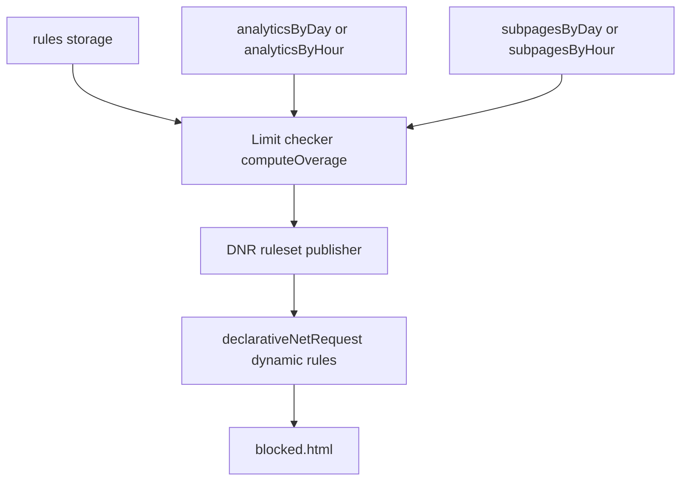

# Enforcement

Blocking sites once they cross a configured limit. BiteGuard already tracks time per site; enforcement reads the existing `rules` and analytics, computes which sites are over their limit, and redirects further requests to a `blocked.html` page until the period rolls over. The enforcement half was implemented in an earlier iteration and deliberately removed during the tracking redesign (see [docs/archive/REDESIGN_ISSUES.md](../archive/REDESIGN_ISSUES.md)); analytics has since stabilized and this rebuilds enforcement on top of it.

## User stories

- As a user, I want a site blocked once I exceed my configured limit over the chosen period, so the limit is actually enforced and not just measured.
- As a user, I want to choose what "time spent" means per rule — focused time, audible time, or both — so background audio and active reading can be limited differently.
- As a user, I want to limit a bare host (`reddit.com`), all its subdomains (`*.reddit.com`), or a specific path (`reddit.com/r/foo`), so I can scope a limit as broadly or narrowly as I need.
- As a user, when I hit a block I want to see which limit I hit and when it resets, so the block is understandable rather than abrupt.

## Acceptance criteria

- [ ] Adding a rule lets me pick a **match type** (host / subdomain / path) and a **mode** (active / audio / active+audio) alongside target, limit, unit, and period.
- [ ] A site I have used past its limit over the rule's period redirects to `blocked.html` within one flush cycle (≤ ~1 min).
- [ ] A `subdomain` rule on `reddit.com` blocks `old.reddit.com`; a `host` rule on `reddit.com` does not.
- [ ] A `path` rule on `twitch.tv/directory` blocks that path but leaves the rest of `twitch.tv` reachable.
- [ ] When the period rolls over (usage drops out of the window) or I disable the rule, the block is removed without restarting the browser.
- [ ] `blocked.html` shows the host/path that was blocked, which limit was hit, and when it resets.
- [ ] Existing stored rules created before this feature keep working — they behave as `mode: 'active'`, `matchType: 'host'`.

## Scope

### Surfaces involved

| Surface | Role in this feature |
|---|---|
| popup | Rule form gains match-type and mode controls; rule list shows them. |
| background | Reads `rules`, runs the limit checker each flush, publishes DNR rules. |
| blocked page | Reads query params, shows which limit was hit and reset time. |

### Files likely to change

| File | Change |
|---|---|
| `src/pages/popup/popup.html` | Add match-type dropdown and mode dropdown to `#add-form`. |
| `src/pages/popup/popup.js` | Write `matchType` + `mode` on save; render them in the rule list. |
| `src/background/background.js` | Wire limit checker + DNR publisher into the flush alarm; read `rules`. |
| `src/background/enforcement.js` *(new)* | `computeOverage` (pure) + DNR publish/diff helpers. |
| `src/data/migrations.js` | `v3 → v4`: backfill `mode:'active'` and `matchType:'host'` on every stored rule. |
| `src/pages/blocked/blocked.html` | Read `?rule=&site=&path=`; show limit + reset time (currently reads `?host=`). |

### Storage / tracking

| Key | Shape | Read by | Written by | Notes |
|---|---|---|---|---|
| `rules` | `{ id, target, matchType, limit, limitUnit, period, enabled, mode }` | popup, background | popup, migration | `matchType` + `mode` are new; `v3→v4` migration backfills both. |
| `analyticsByDay` / `analyticsByHour` | `{ [bucket]: { [host]: { activeMs, audioMs, overlapMs, visits } } }` | limit checker | tracking | Source for `host` / `subdomain` rules. Unchanged. |
| `subpagesByDay` / `subpagesByHour` | `{ [bucket]: { [host]: { [path]: { activeMs, audioMs, overlapMs, visits } } } }` | limit checker | subpage tracking | Source for `path` rules. Unchanged. |
| `storageVersion` | `number` | migrations | migrations | Bumped to `4`. |

### What's already in place (no change)

- `declarativeNetRequest` permission ([manifest.json:28](../../manifest.json#L28)) — declared, currently unused.
- `blocked.html` web-accessible resource ([manifest.json:32](../../manifest.json#L32)).
- All three accumulators (`activeMs`, `audioMs`, `overlapMs`) per site and per path.
- The 1-minute `flush` alarm in [background.js](../../src/background/background.js) — the checker hooks onto its tail.

## Architecture

1. **Limit checker** — runs at the end of each flush alarm. For each enabled rule: compute the period window (`hour` → current `hourKey`; `day` → today's `dayKey`; `week` → last 7 `dayKey`s), read the matching source (analytics for host/subdomain, subpages for path), apply the mode formula, compare to `limit × unitMultiplier`. Produces the overage set: `Map<ruleId, { target, matchType, path, overBy }>`. Pure and unit-testable — no chrome APIs.
2. **DNR publisher** — diffs the new overage set against the previously published one. Added entries register a dynamic redirect rule to `blocked.html?rule=<id>&site=<host>&path=<path>`; removed entries are deleted. Uses `chrome.declarativeNetRequest.updateDynamicRules`. `urlFilter` shape per match type:
   - `host` → `||<target>^` scoped so subdomains do not match.
   - `subdomain` → domain-anchored filter matching `<target>` and `*.<target>`.
   - `path` → `||<host><path>`.
3. **Period boundaries** — the flush alarm fires every minute regardless, so a rolled-over window shrinks the overage set on the next tick. No special boundary handler.

### Blocking modes

| Mode | Formula | Behavior |
|---|---|---|
| `active` | `activeMs` | Time the site was in the focused window. |
| `audio` | `audioMs` | Time the site had an audible, unmuted tab, regardless of focus. |
| `active+audio` | `activeMs + audioMs − overlapMs` | Union of both — "background podcasts shouldn't count, but reading the article should." |

Existing rules without `mode` are backfilled to `active`.

## Implementation order

Smallest shippable slice first:

1. **Schema + form** — add `matchType` and `mode` to the rule shape, the popup form, and the rule-list render. Add the `v3→v4` migration backfilling both fields. No blocking behavior yet.
2. **Limit checker** — `computeOverage(rules, { analyticsByDay, analyticsByHour, subpagesByDay, subpagesByHour }, now)`. Wire into the flush alarm but only `console.log` the overage set for verification.
3. **DNR publisher** — diff overage sets, call `updateDynamicRules`, redirect to `blocked.html`. First real blocking; verify in browser per match type.
4. **`blocked.html` polish** — read `?rule=&site=&path=`, show which limit was hit and when it resets. Supersedes the current `?host=` param.
5. **Navigation-time short-circuit** *(optional, v1.1)* — `webNavigation.onBeforeNavigate` consults a cached overage set to block immediately rather than waiting for the next flush.

## Edge cases

- **Legacy rule with no `mode`/`matchType`** → migration backfills `active`/`host`; readers can assume the full shape afterward, no defensive defaults.
- **Period rolls over mid-session** → next flush tick recomputes a smaller overage set and the publisher removes the stale DNR rule.
- **Rule disabled while over limit** → checker skips disabled rules; publisher removes its DNR rule on the next tick.
- **Tab already open when the limit is crossed** → reactive blocking means it stays until the next flush (≤ ~1 min) or next navigation; slice 5 closes this gap.
- **`path` rule but no subpage data for the host** → treated as zero usage; not blocked.

## Out of scope (v1)

- **Regex / arbitrary URL-pattern matching** (`regexFilter`) — only the three structural match types ship.
- **Pre-emptive blocking** — predicting a crossing from in-memory tracker state before the flush. Reactive only.
- **Rule uniqueness validation** — no enforced dedupe of `(target, matchType, period)`. Noted in [docs/ideas/IDEAS.md](../ideas/IDEAS.md).
- **Target/hostname validation at save time** — malformed targets aren't rejected yet. Noted in [docs/ideas/IDEAS.md](../ideas/IDEAS.md).

## References

- Previous enforcement design (since removed): [docs/archive/TRACKING_REDESIGN.md](../archive/TRACKING_REDESIGN.md), [docs/archive/REDESIGN_ISSUES.md](../archive/REDESIGN_ISSUES.md).
- Path-scoped limits origin: [docs/features/subpage-tracking/TODO.md](subpage-tracking/TODO.md).
- General feature ideas / open questions: [docs/ideas/IDEAS.md](../ideas/IDEAS.md).
