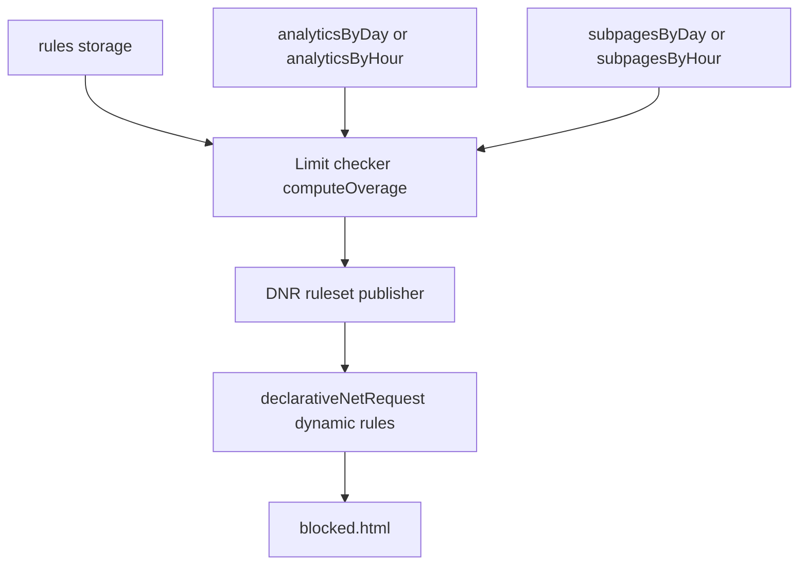

# Enforcement

Blocking sites once they cross a configured limit. BiteGuard already tracks time per site; enforcement reads the existing `rules` and analytics, computes which sites are over their limit, and redirects further requests to a `blocked.html` page until the period rolls over. The enforcement half was implemented in an earlier iteration and deliberately removed during the tracking redesign (see [docs/archive/REDESIGN_ISSUES.md](../archive/REDESIGN_ISSUES.md)); analytics has since stabilized and this rebuilds enforcement on top of it.

## User stories

- As a user, I want a site blocked once I exceed my configured limit over the chosen period, so the limit is actually enforced and not just measured.
- As a user, I want to choose what "time spent" means per rule — focused time, audible time, or both — so background audio and active reading can be limited differently.
- As a user, I want to limit a bare host (`reddit.com`), all its subdomains (`*.reddit.com`), an exact path (`reddit.com/r/foo`), or a path and everything under it (`reddit.com/r/foo*`), so I can scope a limit as broadly or narrowly as I need.
- As a user, when I hit a block I want to see which limit I hit and when it resets, so the block is understandable rather than abrupt.

## Acceptance criteria

- [ ] Adding a rule lets me pick a **scope** (this site / this site + subdomains / a specific page) and a **mode** (active / audio / active+audio) alongside the host, limit, unit, and period.
- [ ] The form shows a live preview of what the rule will block — a plain-English line plus the resolved URL-filter pattern.
- [ ] A site I have used past its limit over the rule's period redirects to `blocked.html` within one flush cycle (≤ ~1 min).
- [ ] A `subdomain` rule on `reddit.com` blocks `old.reddit.com`; a `host` rule on `reddit.com` does not.
- [ ] A `pathPrefix` rule on `twitch.tv` with path `directory` blocks that path and everything beneath it (`/directory/game/...`) but leaves the rest of `twitch.tv` reachable.
- [ ] When the period rolls over (usage drops out of the window) or I disable the rule, the block is removed without restarting the browser.
- [ ] `blocked.html` shows the host/path that was blocked, which limit was hit, and when it resets.
- [ ] Existing stored rules created before this feature keep working — they behave as `mode: 'active'`, `matchType: 'host'`.

## Scope

### Surfaces involved

| Surface | Role in this feature |
|---|---|
| rules page *(new)* | Full-page rule management: add/edit/list rules with match-type and mode controls. |
| background | Reads `rules`, runs the limit checker each flush, publishes DNR rules. |
| blocked page | Reads query params, shows which limit was hit and reset time. |

The dedicated rules page is where rule management lives for v1. The existing popup rule UI is left as-is for now; reworking the popup into a launcher to this page is deferred (see Out of scope).

### Files likely to change

| File | Change |
|---|---|
| `src/pages/rules/rules.html` *(new)* | Full-page rule form (host, scope, optional path, limit, unit, period, mode) + live block preview + rule list, reusing the shared header. |
| `src/pages/rules/rules.js` *(new)* | Page wiring: scope→path-field toggle, live preview, form submit, list render. Rule logic comes from the shared module. |
| `src/pages/rules/rules.css` *(new)* | Page-specific layout; reuse shared classes from `theme.css`. |
| `src/shared/rules.js` *(new)* | Extracted rule logic shared by the rules page and the popup: add/toggle/delete, render a rule list, custom-dropdown init. |
| `src/pages/popup/popup.js` | Adopt `src/shared/rules.js` for save/toggle/delete/render; drop the duplicated inline logic. |
| `src/pages/dashboard/dashboard.html` | Add a "Rules" entry button to `#header-left` to reach the rules page. |
| `src/background/background.js` | Wire limit checker + DNR publisher into the flush alarm; read `rules`. |
| `src/background/enforcement.js` *(new)* | `computeOverage` (pure) + DNR publish/diff helpers. |
| `src/data/migrations.js` | `v3 → v4`: backfill `mode:'active'` and `matchType:'host'` on every stored rule. |
| `src/pages/blocked/blocked.html` | Read `?rule=&site=&path=`; show limit + reset time (currently reads `?host=`). |

### Storage / tracking

| Key | Shape | Read by | Written by | Notes |
|---|---|---|---|---|
| `rules` | `{ id, target, path?, matchType, limit, limitUnit, period, enabled, mode }` | rules page, popup, background | rules page, popup, migration | `target` is always a bare host; `path` is set only for `path`/`pathPrefix` rules. `matchType` + `mode` are new; `v3→v4` migration backfills both. |
| `analyticsByDay` / `analyticsByHour` | `{ [bucket]: { [host]: { activeMs, audioMs, overlapMs, visits } } }` | limit checker | tracking | Source for `host` / `subdomain` rules. Unchanged. |
| `subpagesByDay` / `subpagesByHour` | `{ [bucket]: { [host]: { [path]: { activeMs, audioMs, overlapMs, visits } } } }` | limit checker | subpage tracking | Source for `path` rules. Unchanged. |
| `storageVersion` | `number` | migrations | migrations | Bumped to `4`. |

### What's already in place (no change)

- `declarativeNetRequest` permission ([manifest.json:28](../../manifest.json#L28)) — declared, currently unused.
- `blocked.html` web-accessible resource ([manifest.json:32](../../manifest.json#L32)).
- All three accumulators (`activeMs`, `audioMs`, `overlapMs`) per site and per path.
- The 1-minute `flush` alarm in [background.js](../../src/background/background.js) — the checker hooks onto its tail.

## Architecture

1. **Limit checker** — runs at the end of each flush alarm. For each enabled rule: compute the period window (`hour` → current `hourKey`; `day` → today's `dayKey`; `week` → the `dayKey`s from this Monday through today, a calendar week that resets at the week boundary), sum the matching usage over that window (see [Matching against tracking data](#matching-against-tracking-data)), apply the mode formula, compare to `limit × unitMultiplier`. Produces the overage set: `Map<ruleId, { target, matchType, path, overBy }>`. Pure and unit-testable — no chrome APIs.
2. **DNR publisher** — diffs the new overage set against the previously published one. Added entries register a dynamic redirect rule to `blocked.html?rule=<id>&site=<host>&path=<path>`; removed entries are deleted. Uses `chrome.declarativeNetRequest.updateDynamicRules`. `urlFilter` shape per match type:
   - `host` → `regexFilter: ^https?://<target>(?:/|$)` (RE2). DNR's `||` domain anchor and `requestDomains` are both subdomain-inclusive by design ([Chrome docs](https://developer.chrome.com/docs/extensions/reference/api/declarativeNetRequest)), so an exact-host block is only achievable via an anchored `regexFilter`. The `<target>` dot must be escaped (`reddit\.com`); the host is punycode-encoded for matching.
   - `subdomain` → `urlFilter: ||<target>^` (the natural DNR domain anchor — matches apex + all subdomains).
   - `pathPrefix` → `regexFilter: ^https?://<target>/<path>(?:[/?]|$)` (RE2). A bare `urlFilter: ||<target>/<path>` would over-block sibling paths sharing a prefix (`/maps` matching `/maps-beta`), so the boundary `(?:[/?]|$)` is anchored to a path separator, query, or end — matching the analytics boundary rule exactly. Both `<target>` and `<path>` have regex metacharacters escaped. A `pathPrefix` rule always carries a non-empty path (enforced by the form).

   This makes the three scopes genuinely distinct at the block level (not only in usage counting). Two of the three (`host`, `pathPrefix`) use `regexFilter`, which is capped (≤1000 per ruleset, <2KB compiled each); these rules are simple and well under the limits.

   **`www.` handling:** tracking strips a leading `www.` ([siteResolution.js](../../src/background/siteResolution.js)), so `www.reddit.com` counts as `reddit.com`. But the literal `host` regex above would not match a `www.reddit.com` *URL*. To keep blocking consistent with counting, the `host` regex should allow an optional `www.`: `^https?://(?:www\.)?<target>(?:/|$)`.
3. **Period boundaries** — the flush alarm fires every minute regardless, so a rolled-over window shrinks the overage set on the next tick. No special boundary handler.

### Matching against tracking data

The checker sums usage from tracking storage, whose key shapes are fixed by [siteResolution.js](../../src/background/siteResolution.js) and must be matched exactly:

- **Site keys** (`analyticsByDay[bucket][siteId]`) are the full hostname with only a leading `www.` stripped — `siteIdFromUrl`. So `reddit.com`, `old.reddit.com`, `m.reddit.com` are **separate keys**; `www.reddit.com` collapses to `reddit.com`.
- **Subpage keys** (`subpagesByDay[bucket][siteId][path]`) use `pathFromUrl`: `pathname` with any trailing slash stripped (except root `/`), **with the query string appended** (`/r/news?sort=top`).

Consequences the checker must honor:

| Match type | How usage is summed |
|---|---|
| `host` | Exact `analytics[bucket][target]` only. Does **not** include subdomains — `old.reddit.com` is a different key. |
| `subdomain` | Sum every `analytics[bucket][k]` where `k === target` **or** `k` ends with `.${target}`. Includes the apex. A scan of the bucket's keys, not a lookup. |
| `pathPrefix` | Sum every `subpages[bucket][target][p]` where `p === '/'+rule.path` **or** `p` starts with `'/'+rule.path` followed by `/`, `?`, or end. Always carries a non-empty path. |

Exact-path matching was considered and dropped: stored subpage keys include the query string (`/maps?q=x`), so an exact path rarely matches a real visit — hence page rules are always prefix.

Two design facts this surfaces, both reflected in the form and the out-of-scope list:

- **`host` does not mean "whole site."** It matches one hostname. A user wanting all of reddit (including `old.reddit.com`) needs `subdomain`. The form copy must not call `host` "the entire site."
- **`host` requires `regexFilter`, not `||`.** Because DNR's `||`/`requestDomains` are subdomain-inclusive, the exact-host block and the exact-host usage sum line up only when the DNR rule uses the anchored `regexFilter` above. The two site scopes (`host`, `subdomain`) therefore compile to genuinely different DNR rules.

### Blocking modes

| Mode | Formula | Behavior |
|---|---|---|
| `active` | `activeMs` | Time the site was in the focused window. |
| `audio` | `audioMs` | Time the site had an audible, unmuted tab, regardless of focus. |
| `active+audio` | `activeMs + audioMs − overlapMs` | Union of both — "background podcasts shouldn't count, but reading the article should." |

Existing rules without `mode` are backfilled to `active`.

## Implementation order

Smallest shippable slice first:

1. ✅ **Schema + form** — `matchType` and `mode` on the rule shape, the rules-page form, and the rule-list render; `v3→v4` migration backfills both. No blocking behavior.
2. ✅ **Limit checker** — pure `computeOverage(rules, { analyticsByDay, analyticsByHour, subpagesByDay, subpagesByHour }, now)`, wired into the flush alarm.
3. ✅ **DNR publisher** — `publishOverage` diffs the overage set against `getDynamicRules` and calls `updateDynamicRules`, redirecting matches to `blocked.html`. First real blocking.
4. ✅ **`blocked.html` polish** — reads `?rule=&site=&path=`; shows the blocked target, the limit (`<limit> per <period>`), and when the window next resets (local time, calendar-week aware), plus a "Manage rules" link. The inline script was moved to `blocked.js` (MV3 CSP forbids inline scripts).
5. ~~**Navigation-time short-circuit**~~ — **dropped.** Consulting the *cached* overage set at nav time is redundant: the DNR rules from the last `publishOverage` already block matching navigations. The only value would be catching a mid-flush-window crossing ~1 min sooner, which requires a live-usage-aware check (flushed storage + the tracker's in-memory pending ranges) — a second matching path to keep consistent with `computeOverage`, not worth the complexity for a sub-minute overshoot. Revisit only if the ≤1-flush delay proves a problem in practice; a cheaper mitigation is shortening the flush interval.

## Edge cases

- **Legacy rule with no `mode`/`matchType`** → migration backfills `active`/`host`; readers can assume the full shape afterward, no defensive defaults.
- **Period rolls over mid-session** → next flush tick recomputes a smaller overage set and the publisher removes the stale DNR rule.
- **Rule disabled while over limit** → checker skips disabled rules; publisher removes its DNR rule on the next tick.
- **Tab already open when the limit is crossed** → reactive blocking means it stays until the next flush (≤ ~1 min) or next navigation; slice 5 closes this gap.
- **`path` rule but no subpage data for the host** → treated as zero usage; not blocked.

## Out of scope (v1)

- **Popup rework** — the popup adopts `src/shared/rules.js` but keeps its own inline form layout. Reworking it into a launcher that opens the dedicated rules page is deferred. Until then both surfaces write the same `rules` key.
- **Rules entry-point placement** — the rules page is reached from a button in the dashboard's `#header-left` for now. This is a stopgap; a better-positioned entry point may replace it later.
- **User-supplied regex matching** — the three structural scopes ship. (The publisher uses `regexFilter` internally for `host`/`pathPrefix`, but users can't enter arbitrary patterns.)
- **Rolling-7-day week** — `week` is a calendar week (Monday-start, resets at the boundary) for v1, consistent with how `day`/`hour` reset. A rolling 7-day window (sliding daily, matching the dashboard's "Last 7 days") is a deferred variant; revisit if users find the weekly reset surprising.
- **Week-start user setting** — the calendar week starts on Monday (hardcoded) for v1. A user setting to choose Monday vs Sunday (and any other locale-sensitive week start) is deferred; `windowKeys` in [enforcement.js](../../src/background/enforcement.js) would read it instead of assuming Monday.
- **Pre-emptive blocking** — predicting a crossing from in-memory tracker state before the flush. Reactive only.
- **Rule uniqueness validation** — no enforced dedupe of `(target, matchType, period)`. Noted in [docs/ideas/IDEAS.md](../ideas/IDEAS.md).
- **Target/hostname validation at save time** — malformed targets aren't rejected yet. Noted in [docs/ideas/IDEAS.md](../ideas/IDEAS.md).

## References

- Previous enforcement design (since removed): [docs/archive/TRACKING_REDESIGN.md](../archive/TRACKING_REDESIGN.md), [docs/archive/REDESIGN_ISSUES.md](../archive/REDESIGN_ISSUES.md).
- Path-scoped limits origin: [docs/features/subpage-tracking/TODO.md](subpage-tracking/TODO.md).
- General feature ideas / open questions: [docs/ideas/IDEAS.md](../ideas/IDEAS.md).
