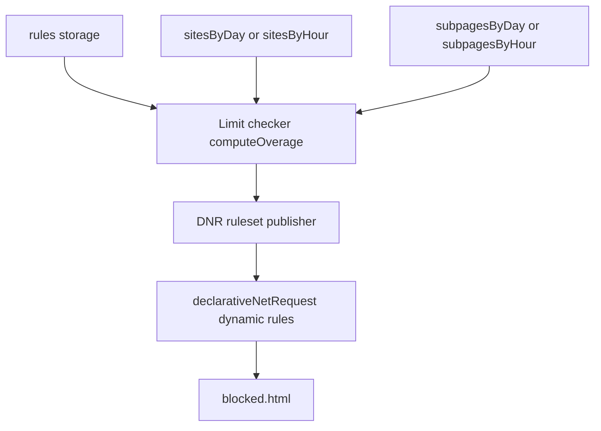

# Enforcement

TL;DR: reads `rules` plus tracking data, works out which sites are over their limit, and publishes `declarativeNetRequest` redirects to `blocked.html` until the period rolls over. Shipped. Full acceptance checklist, per-file changes and build order: [appendix](../../appendix/enforcement-implementation.md).

## User stories

- As a user, I want a site blocked once I pass my limit, so the limit is enforced and not only measured.
- As a user, I want to choose what "time spent" means per rule — focused, audible, or both.
- As a user, I want to limit a bare host, all its subdomains, or a path and everything under it.
- As a user, when I hit a block I want to see which limit I hit and when it resets.

## Architecture

- **Limit checker** — runs at the end of each flush alarm. Per enabled rule it builds the period window (`hour` → current hour key; `day` → today; `week` → this calendar week from the user's week start), sums matching usage, applies the mode formula, and compares against `limit × unitMultiplier`. Pure, no chrome APIs, unit-testable.
- **DNR publisher** — `publishOverage` diffs the new overage set against the published dynamic rules. Each rule's DNR id is a deterministic 31-bit hash of its UUID (`dnrIdFor`). It also increments `blocksByDay` on each newly triggered block.
- **Period boundaries** — no special handler. The flush alarm fires every minute, so a rolled-over window simply produces a smaller overage set on the next tick.

## Matching against tracking data

Key shapes are fixed by `siteResolution.js` and must be matched exactly:

- Site keys are the full hostname with only a leading `www.` stripped, so `reddit.com`, `old.reddit.com` and `m.reddit.com` are separate keys.
- Subpage keys are the pathname with any trailing slash stripped, **with the query string appended** (`/r/news?sort=top`).

| Match type | How usage is summed | DNR filter |
| --- | --- | --- |
| `host` | Exact site key only; subdomains excluded | `regexFilter: ^https?://(?:www\.)?<target>(?:/|$)` |
| `subdomain` | Every key equal to the target or ending `.target`, apex included | `urlFilter: \|\|<target>^` |
| `pathPrefix` | Every subpage key equal to `/path` or starting `/path` followed by `/`, `?`, or end | `regexFilter: ^https?://<target>/<path>(?:[/?]\|$)` |

Two consequences worth keeping in mind:

- **`host` does not mean "the whole site".** It matches one hostname. All of reddit including `old.reddit.com` needs `subdomain`, and the form copy must not call `host` the entire site.
- **`host` needs `regexFilter`, not `||`.** DNR's `||` anchor and `requestDomains` are subdomain-inclusive by design, so only the anchored regex makes the block line up with the usage sum. A bare `||<target>/<path>` would likewise over-block siblings (`/maps` catching `/maps-beta`), which is why the path boundary is anchored.
- Exact-path matching was dropped: stored subpage keys carry the query string, so an exact path rarely matches a real visit. Page rules are always prefix.

## Blocking modes

| Mode | Formula | Behaviour |
| --- | --- | --- |
| `active` | `activeMs` | Time the site was in the focused window |
| `audio` | `audioMs` | Time the site had an audible, unmuted tab, whatever the focus |
| `active+audio` | `activeMs + audioMs − overlapMs` | Union of both |

Rules stored before this feature are backfilled to `mode: 'active'`, `matchType: 'host'` by the `v3 → v4` migration.

## Surfaces involved

| Surface | Role |
| --- | --- |
| rules page | All rule management: add, edit, list, with scope and mode controls |
| popup | Read-only list of enabled rules plus a "Manage rules" button |
| background | Reads `rules`, checks limits each flush and on rule changes, publishes DNR rules, moves tabs in and out of the block |
| blocked page | Shows the blocked target, which limit was hit, and the reset time |

## Edge cases

- **Legacy rule with no `mode` or `matchType`** — the migration backfills both, so readers need no defensive defaults.
- **Period rolls over mid-session** — the next flush tick recomputes a smaller set; the publisher drops the rule and `returnUnblockedTabs` sends blocked tabs back.
- **Rule disabled or deleted while over limit** — the `storage.onChanged` listener re-checks at once, without waiting for a flush.
- **Tab already open when the limit is crossed** — DNR only redirects new requests, so `reloadMatchingTabs` navigates open matches into the block on the same tick, carrying the exact current URL as `&url=` so unblocking returns there.
- **Crossing accrued since the last flush** — `webNavigation.onBeforeNavigate` flushes and re-checks before the page settles, so a fresh crossing blocks at navigation time rather than up to a minute later.
- **Path rule with no subpage data for the host** — counted as zero usage, not blocked.
- **Tab redirected on a fresh navigation** — blocked correctly, but unblocking returns it to the rule target rather than the exact pre-block URL.

## Out of scope

- **User-supplied regex and keyword matching** — the three structural scopes ship. The publisher uses `regexFilter` internally, but users cannot enter patterns. Both tabs are visible as "coming soon" stubs.
- **Reachability check on save** — the target is validated as a registrable domain via `tldts`, but we never test that the site responds.
- **Rolling 7-day week** — `week` is a calendar week that resets at the user's configured week start (`PREF_WEEK_START`, default Monday), consistent with how day and hour reset. Changing the setting mid-week shifts the active boundary once, which is why the settings page gates it behind a confirmation.
- **Continuous redundancy checks** — the disable-redundant prompt fires only when adding a rule. Loosening a rule later will not resurface a previously disabled one, and partly overlapping rules coexist by design.
