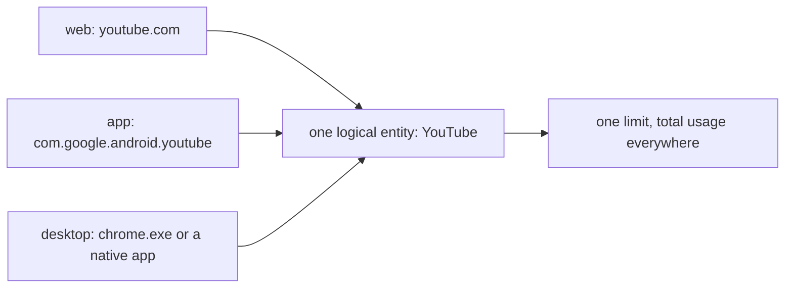
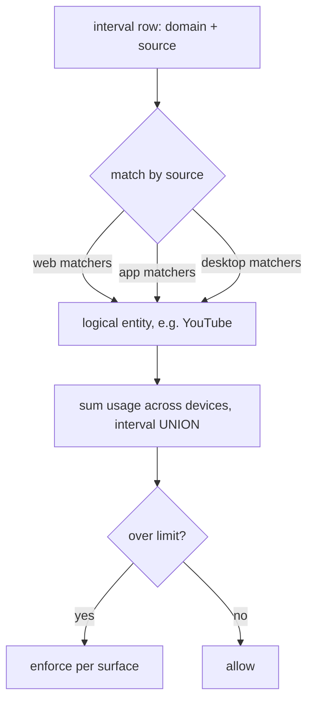
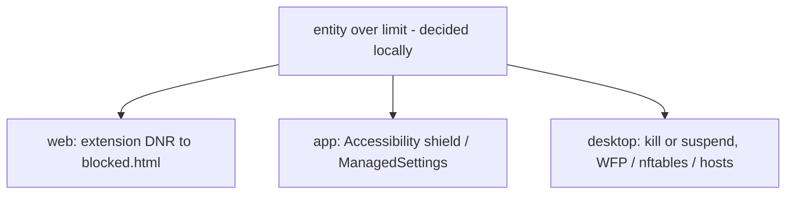

# Entity model

> TL;DR: one combined limit ("YouTube 1h/day everywhere") must count the same thing across **web** (host), **app** (package) and **desktop** (process). Rows carry a `source` tag, a **logical entity** groups matchers across sources, totals are an interval **union**, and enforcement fans out per surface.

**Generalizes** the shipped web-only rules ([enforcement.md](enforcement.md))
without breaking them. **Needs rules-sync** to actually share limits across devices.

## The problem

Today's model is 100% URL-shaped: `matchType` compiles to DNR URL filters, usage is keyed
by host + path. Nothing expresses an app or a process, and **DNR is browser-only** —
structurally unable to block a native app.

## The row

Per the crypto contract, maintained outside this repo,
the wire payload is version-tolerant. What matters here:

| Field | Meaning |
|---|---|
| `domain` | the raw **identifier**: host, package, or executable |
| `source` | `web` \| `app` \| `desktop` — which **namespace** the identifier belongs to |
| `path` | URL path for web; empty otherwise |
| `kind` | `active` (foreground) \| `audio` (holding an audio device) \| `idle` (tracked, not foreground) |

`source` names what the identifier **is**, not the platform — macOS tracking native apps
by bundle id emits `app`, not `desktop`. Type is read from the row, never inferred from
the device: one machine can host both the app and a browser extension.

Where a signal is unavailable (e.g. Wayland foreground), the row is simply absent.

## Resolution

An entity owns a set of **matchers**, each tagged with a `source`:

| source | matchTypes |
|---|---|
| `web` | `host` \| `subdomain` \| `pathPrefix` \| `regex` \| `keyword` — reuses [rules.js](../../src/shared/rules.js) unchanged |
| `app` | `exact` on package |
| `desktop` | `exact` on executable |

**Only same-source matchers are considered**, so cross-namespace collisions are
impossible — a web matcher never sees an app row.

**Backward compatible:** every existing web rule is a single-matcher `web` entity. One
`v4 → v5` migration backfills `source: web`.

**Code impact:** `exact` is a new enum value on the shipped `matchType`. `coversScope`,
`findRedundantRules`, `sumBucket` and `tabMatchesEntry` must learn that `exact` never
covers, and is never covered by, a web matchType.

**Aliases are user-defined in v1.** A curated cross-namespace catalog is a
data-maintenance commitment with no v1 payoff.

## Enforcement fan-out

The **decision** is shared (combined usage ≥ limit, computed locally from the merged
log). The **action** is per-surface. A device only blocks what it hosts.

## Overlap, roles, and resolved sub-decisions

On one machine the extension logs `web:youtube.com` while a desktop tracker logs `desktop:chrome.exe` — the same wall-clock under **two entities**. This is intended and is **not** a double count, because any total is an interval **union** (`unionLen`), never a sum of per-entity durations.

Detail — browser-overlap maths, per-platform producer/consumer roles, extensibility hooks, and the settled sub-decisions on aliases, browser identification, granularity and aggregation cost: [design detail](../appendix/entity-model-design.md).

## Dependencies

- **Rules/alias sync (prerequisite).** Combined cross-device limits assume rules and
  aliases are consistent everywhere. Cloud-sync v1 syncs only the interval log. This
  feature **inherits the full E2E crypto contract** — rules name what a user restricts,
  the same sensitivity class as browsing history, not plain settings. Until it ships,
  limits are per-device.
- **Combined-enforcement rebuild.** [enforcement.md](enforcement.md) is
  web-only and reads scalar buckets today.

## Open

None.
