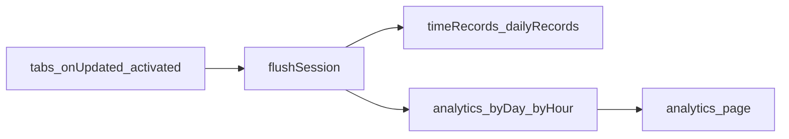

# BiteGuard analytics: data model and implementation plan

## Context from the codebase

Today, `[background.js](d:\GitHub\Personal Repositories\BiteGuard\background.js)` writes `**timeRecords**` (per hostname/rule target) and `**dailyRecords**` for **limit enforcement**; those maps are **reset** by `resetPeriod()` and must **not** be reused as the sole analytics source. Analytics needs a **parallel store** updated in the same places you already persist elapsed time (`flushSession`, and optionally when the service worker starts a new session).

## Your choices (locked in for this plan)

- **Roll-up key**: Same *idea* as eTLD+1, but you want a **short display identity** (e.g. `youtube`, `github`).  
- **Retention**: **Store as much as feasible**, with a **future** explicit “delete older than …” control.

## Important refinement: collisions and storage identity

A **display-only** key like `youtube` is ambiguous across registrable domains (`foo.com` vs `foo.net`). Recommended approach:

- `**siteId` (stored, used for aggregation)**: stable string derived from full **registrable domain** (eTLD+1), e.g. `youtube.com`, `github.io`. This is unique for the web’s purposes.
- `**siteLabel` (derived for UI)**: human-friendly label = registrable domain **minus** public suffix (your “youtube” / “github” story), computed with the same rules as `siteId` (needs a **Public Suffix List–aware** parser, not `hostname.split('.').slice(-2)`).

UI can show `**siteLabel`** as primary text and `**siteId`** (or TLD) as secondary text/tooltip when two labels could collide.

**Implementation note**: In a service worker, use a small, well-tested library (e.g. **tldts**) to compute eTLD+1 and label; ship it bundled with the extension. This is a new dependency—worth it because hand-rolled suffix logic is wrong for `co.uk`, `github.io`, etc.

## Recommended data structures

### 1) Session / flush path (unchanged conceptually)

Keep existing `timeRecords` / `dailyRecords` for blocking; add analytics writes alongside `flushSession()` when you have a resolved `siteId` + elapsed ms.

### 2) Analytics buckets (primary on-disk shape)

Use **calendar buckets in the user’s local timezone** (document this; all “day/week/month” filters align to local midnight unless you later add a setting).

**Option A — start simple (fits `chrome.storage.local` first)**

```ts
// analytics v1 — conceptual shape
analytics: {
  version: 1,
  // key: local calendar day "YYYY-MM-DD"
  byDay: Record<string, Record<string /* siteId */, number /* ms */>>,
}
```

- **Pros**: Tiny code, easy sums for “last X days / month / year”.  
- **Cons**: No intraday chart for “today” beyond “so far today total”; week/month views are coarse unless you add finer buckets later.

**Option B — better graphs without exploding size**

Add **hourly** buckets for a **rolling window** (e.g. last 90 days), and **daily** buckets for older history (compact job when crossing day boundary or on idle):

- `byHour`: `Record<string /* "YYYY-MM-DDTHH" */, Record<siteId, ms>>` (optional cap: drop hours older than N days)
- `byDay`: as above for long retention

**Recommendation**: **Option B** ( `byDay` + local `byHour` ) is the default: it supports intraday views, the average-per-clock-hour chart, and sensible long-term retention (roll old hourly into daily or archive). Option A is only a stripped-down prototype.

**Average-per-clock-hour chart (new requirement)**  
You want a chart for a **chosen key** (`siteId` or a **group** aggregate) that shows, for each local clock hour **0–23**, the **average time spent in that hour** over a selectable window (“last X days/weeks/months”, etc.).

- **Data dependency**: This is **not derivable from `byDay` alone**. You need **per-local-hour** attribution (Option B’s `byHour`, or finer segments rolled into hour keys on write).
- **Computation (recommended definition)**  
  - Let the UI window be `[start, end)` in **local** time.  
  - For each clock hour `H`, let `sum[H]` = sum of all `byHour` bucket values for that key where the bucket’s local hour equals `H` and the bucket’s instant lies in the window.  
  - Let `D` = number of **local calendar days** that the window intersects (each day counts once toward every `H`, so quiet hours show as low averages).  
  - `**avg[H] = sum[H] / D`** — “average amount of this site’s time that fell in the 1 h slot *H* per day in the window.”  
  - **Alternatives** (document in UI or settings if you ever switch): divide by “days where the user had *any* browsing” (denominator varies by `H`), or divide by exact count of `(date, H)` pairs present (similar to `D` for full days). Pick one and label the chart axis helpfully (e.g. “per day in range”).
- **Groups**: For a group, `sum[H]` is the sum of `byHour` values for **all** `siteId`s in the group for that bucket key (then same `avg[H]` formula), or equivalently pre-aggregate in memory when rendering.
- **Edge cases**: **DST** (a day with 23 or 25 hours): bucket keys should come from real local timestamps so counts stay consistent. **Incomplete “today”**: either include partial data with the same `D` or exclude “today” from the average; state the choice in `ANALYTICS.md`.

This chart **reinforces choosing Option B** (hourly buckets) early, not only as a “nice to have.”

### 3) Groups (user-defined bundles)

Separate storage from raw buckets:

```ts
analyticsGroups: Array<{
  id: string;
  name: string;
  siteIds: string[]; // explicit membership; optional "add from current rules" helper later
}>
```

Aggregates for a group = sum of `ms` for contained `siteIds` over the selected time range (computed in the analytics page from `byDay` / `byHour`, not duplicated in storage).

### 4) Long “as far back as possible” history and pruning

- `**chrome.storage.local**` has a practical quota (~10MB). Heavy multi-year **hourly** data will hit it.  
- **Plan split**: keep **recent** detailed buckets in `storage.local`; for “years” of history, **migrate archive buckets to IndexedDB** (much larger quota on extension origin) with the same keying scheme, and query merges **recent + archive** in the analytics page.  
- **Pruning job** (future): delete buckets older than cutoff in both stores; expose UI “Keep last X months/years”.

### 5) Data export (download)

Goal: user can **download everything** the extension has collected for analytics (and optionally related config) in formats that open in spreadsheets or backup tools.

**Formats (recommended order)**

- **CSV (primary)** — One **long** table per dataset, no extra dependency. Suggested files: `by_day` with columns `bucket_date`, `site_id`, `ms`; `by_hour` with `bucket_local_datetime`, `site_id`, `ms`. Quote fields that may contain commas; UTF-8 with optional BOM for Excel on Windows.
- **JSON (backup / round-trip)** — Mirrors internal shapes: `analytics`, `analyticsGroups`, `exportVersion`, `exportedAt`, extension version. Good for backups and scripts; weaker as a hand-edited spreadsheet.
- **ZIP (optional convenience)** — Bundle the CSVs plus a small `export.json` metadata file (and `groups.json` if you split groups).
- **XLSX (phase 2)** — Friendliest for Excel-only users; needs a library (e.g. SheetJS) and bundle size tradeoff—defer unless you insist on v1.
- **Plain TXT** — Skip unless you want a short human-readable summary derived from the same aggregates (not a substitute for data export).

**Scope of “all the data”**  

- **Minimum**: all `analytics` bucket keys (`byDay`, `byHour`) with ms per `siteId`.  
- **Optional second checkbox**: include `**rules`**, `**timeRecords**`, `**dailyRecords**` (limit state) in the same zip or a separate JSON — clearly labeled so users know those are not the same as long-term analytics.  
- If **IndexedDB archive** exists later, export must **merge** archive + `storage.local` before writing files.

**Implementation (extension page)**  

- Build strings/Blobs in the analytics (or settings) page; trigger download with `**<a download href="blob:...">`** — **no** `downloads` permission required.  
- Alternatively `chrome.downloads` with `"downloads"` permission if you prefer writing straight to disk with a save dialog API; not required for MVP.

**Privacy**  

- Export is local-only; remind user the file contains browsing-derived data and should be stored carefully.

Document column names, JSON schema version, and merge rules in `ANALYTICS.md`.

## UI / extension surface

- **Dedicated page** (not the small popup): add an `**options_ui`** page or a normal extension page opened from a link in the popup (“Analytics”) via `chrome.runtime.openURL` / options. Charts need space.  
- **Permissions**: No new host permissions if analytics only reads tab URLs you already handle; **no** `history` permission required if you only attribute time from your own timers (recommended).  
- **Charts**: choose one path and stick to it for v1:  
  - **Canvas/SVG + your own bars** (zero deps, CLAUDE.md-friendly), or  
  - **One chart library** (faster for line/bar), added only when you start the graphs milestone.

## Query / filter model (for the UI)

Represent every preset as `**[startMs, endMs)`** in local time:

- Today / this week / this month / this year  
- “Last N days/weeks/months/years” = rolling window ending **now**

Implementation: small pure functions that convert `Date` ↔ local boundaries; then sum buckets whose keys fall in range (for days: iterate date keys; for hours: iterate hour keys).

## Documentation (MD files you asked for)

After you approve direction, add **one** focused doc (per your repo rule: do not create files until you confirm the path):

- Suggested: `[docs/ANALYTICS.md](d:\GitHub\Personal Repositories\BiteGuard\docs\ANALYTICS.md)` (or project root if you prefer no `docs/` folder) containing:
  - **Definitions**: `siteId`, `siteLabel`, timezone, bucket keys  
  - **JSON shapes**: `analytics`, `analyticsGroups`, versioning/migration  
  - **Pseudocode** for flush → bucket update and for range aggregation  
  - **Retention / pruning** policy placeholders  
  - **UI**: filter matrix + chart list (top‑K, groups, average per clock hour, **export/download**)

*(Per [CLAUDE.md](d:\GitHub\Personal Repositories\BiteGuard\CLAUDE.md): confirm before creating the file.)*

## Implementation phases

1. **Site resolution module**: URL → `siteId` + `siteLabel` (tldts or equivalent); unit-test tricky hostnames (`bbc.co.uk`, `foo.github.io`, `com.cn` cases).
2. **Write path**: extend `[flushSession](d:\GitHub\Personal Repositories\BiteGuard\background.js)` (and any other flush points) to add elapsed ms into `analytics.byDay` and `analytics.byHour` (split segments at local hour boundaries). Never touch this store from `resetPeriod`.
3. **Analytics page**: read storage, apply range filter, render **table** (siteLabel, siteId, ms, % of total).
4. **Graphs v1**: top‑K bar chart; **average per local clock hour** for selected `siteId` or group (requires `byHour`). Optional “compare this week vs last week” later.
5. **Export**: buttons to download **CSV** (and **JSON** dump); optional ZIP bundle; merge IndexedDB archive when that exists.
6. **Groups**: CRUD UI + aggregated series.
7. **Scale-up**: IndexedDB archive + compaction + settings for max retention.




## Open detail (optional follow-up)

If you want **intra-day** charts in v1 without hourly buckets, we can add a **“today running breakdown”** that only sums **current session + flushed segments since midnight** in memory—but that still needs **per-flush segments** stored for today (lightweight list capped at 24h). Say if you want that shortcut vs going straight to hourly buckets.
